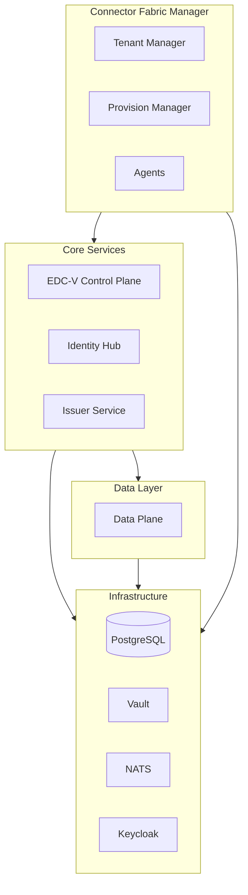
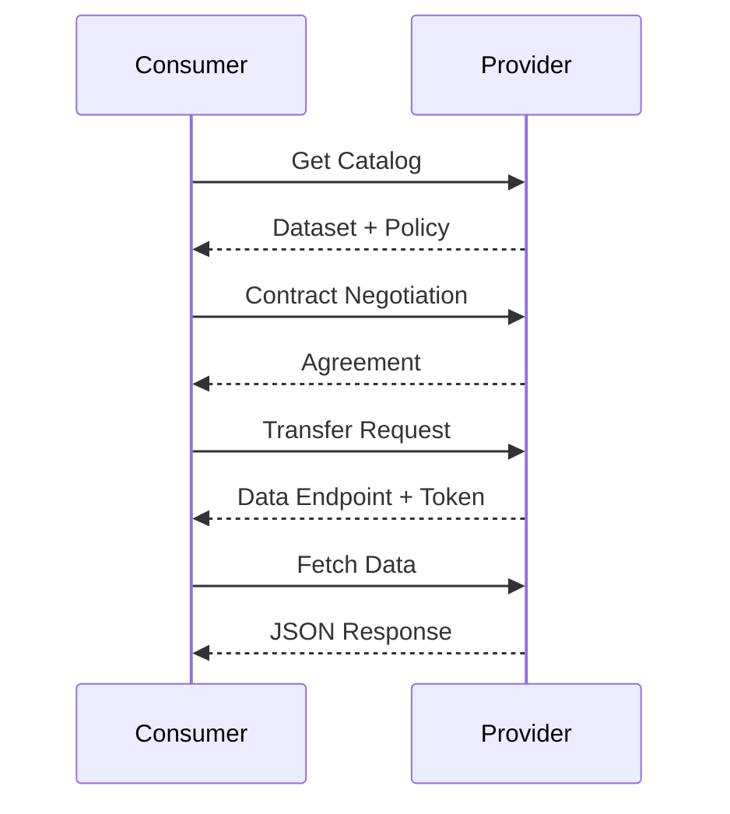

import Tabs from '@theme/Tabs';
import TabItem from '@theme/TabItem';

If you're a cloud provider evaluating dataspace technology, reading documentation only gets you so far. You need to see it working. JAD (Just Another Demonstrator) is the reference implementation that deploys a complete dataspace-as-a-service in Kubernetes — showing exactly how all the pieces fit together.

<!-- truncate -->

:::tip What You'll Learn
This article covers JAD's architecture, deployment steps, and what cloud providers should study when evaluating it. By the end, you'll know how to get JAD running locally and understand the patterns it demonstrates.
:::

## Why JAD Matters

Cloud providers considering dataspaces face a challenge: the technology stack has many components, and understanding how they integrate requires hands-on experience. JAD solves this by providing:

- **A complete, working deployment** — Not a toy demo, but the full architecture
- **Multi-tenant infrastructure** — Using EDC-V (Virtual Connector) for real economics
- **Automated tenant management** — Via the Connector Fabric Manager
- **End-to-end workflows** — From onboarding to data transfer

Think of JAD as the blueprint. It shows you the target architecture before you build your own.

## What's In The Box

JAD deploys nine core services plus supporting infrastructure. Here's what each does:

### Control Plane (EDC-V)

The Virtual Connector is the heart of multi-tenant efficiency. Instead of running a separate connector per customer (expensive), EDC-V virtualizes the control plane:

- Shared runtime with isolated participant contexts
- Single deployment serves hundreds or thousands of tenants
- Per-tenant data planes when needed for isolation

This is what makes dataspace-as-a-service economically viable.

### Identity Hub

Every dataspace participant needs a decentralized identity. The Identity Hub manages:

- **DIDs (Decentralized Identifiers)** — Each tenant gets a resolvable identity
- **Verifiable Credentials** — Stored securely, presented when needed
- **Presentation API** — Responds to credential verification requests

### Issuer Service

Credentials must come from trusted authorities. The Issuer Service:

- Issues verifiable credentials to participants after onboarding
- Integrates with dataspace governance (who can issue what)
- Supports multiple credential types (membership, certifications, roles)

### Data Plane

The actual data transfer happens here. JAD includes HTTP-based data planes supporting:

- Proxy transfers (fetch and forward)
- Direct access (generate tokens for consumer access)
- File/certificate sharing workflows

### Connector Fabric Manager (CFM)

This is the automation layer cloud providers need. CFM handles:

- **Tenant provisioning** — When a customer signs up, CFM creates their context
- **Credential orchestration** — Requests and stores credentials automatically
- **Stateful workflows** — Uses NATS messaging for reliable async operations
- **Agent architecture** — Extensible agents execute provisioning actions

Without CFM, you'd manually configure each tenant. With CFM, onboarding is self-service.

### Supporting Infrastructure

JAD includes everything needed for a production-like deployment:

| Component | Purpose |
|-----------|---------|
| PostgreSQL | Persistent state for all components |
| HashiCorp Vault | Secrets management (private keys, tokens) |
| NATS | Async messaging for CFM orchestration |
| Keycloak | API authentication via OAuth2 |
| Traefik | Gateway controller for external access |

## Architecture Overview

Here's how the components relate:



The **CFM** orchestrates tenant lifecycle, provisioning participant contexts across the core services. Each service stores state in **PostgreSQL**, secrets in **Vault**, and authenticates via **Keycloak**.

## Getting JAD Running

JAD is designed for KinD (Kubernetes in Docker) for local development. Here's the quick path:

### Prerequisites

Before starting, ensure you have:

- Docker installed and running
- KinD (Kubernetes in Docker)
- kubectl
- Helm
- Java 17+ (if building from source)
- Bruno (for API testing)

<details>
  <summary>Building from source (optional)</summary>
  <div>

If you want to modify JAD and test your changes, you can build from source:

```bash title="Build Docker images"
./gradlew dockerize
```

Then load into KinD:

```bash title="Load images into KinD"
kind load docker-image \
    ghcr.io/metaform/jad/controlplane:latest \
    ghcr.io/metaform/jad/identity-hub:latest \
    ghcr.io/metaform/jad/issuerservice:latest \
    ghcr.io/metaform/jad/dataplane:latest -n edcv
```

Update deployment manifests to use local images:

```bash title="Set imagePullPolicy to Never"
grep -rlZ "imagePullPolicy: Always" k8s/apps | xargs sed -i "s/imagePullPolicy:.*Always/imagePullPolicy: Never/g"
```

:::note macOS Users
The `sed -i` command requires GNU sed. Install via `brew install gnu-sed` and use `gsed` instead.
:::

  </div>
</details>

### Step 1: Create the Cluster

```bash title="Create KinD cluster"
# Backup existing kubeconfig
cp ~/.kube/config ~/.kube/config.bak

# Create KinD cluster
kind create cluster -n edcv --kubeconfig ~/.kube/edcv-kind.conf
ln -sf ~/.kube/edcv-kind.conf ~/.kube/config
```

### Step 2: Install Traefik Gateway

```bash title="Install Traefik via Helm"
helm repo add traefik https://traefik.github.io/charts
helm repo update
helm upgrade --install --namespace traefik traefik traefik/traefik \
  --create-namespace -f values.yaml
```

Then install Gateway API CRDs:

```bash title="Install Gateway API CRDs"
kubectl apply --server-side --force-conflicts \
  -f https://github.com/kubernetes-sigs/gateway-api/releases/download/v1.4.1/experimental-install.yaml
```

### Step 3: Enable Network Access

Choose your preferred method for accessing services from outside the cluster:

<Tabs>
  <TabItem value="port-forward" label="Port Forwarding (Recommended)" default>

For local development, port-forwarding is simplest:

```bash
kubectl -n traefik port-forward svc/traefik 80
```

:::note
You may need `sudo` on some systems to bind to port 80.
:::

  </TabItem>
  <TabItem value="loadbalancer" label="LoadBalancer (Cloud-like)">

For a more production-like setup, install cloud-provider-kind to emulate a load balancer:

```bash
# Install cloud-provider-kind per its documentation
cloud-provider-kind

# On macOS, you may need sudo:
sudo cloud-provider-kind
```

Verify the external IP is assigned:

```bash
kubectl get svc -n traefik
```

You should see an `EXTERNAL-IP` instead of `<pending>`.

:::warning
With the external LB, services must be accessed via the external IP address. Update your Bruno collection variables accordingly.
:::

  </TabItem>
</Tabs>

### Step 4: Deploy JAD

```bash title="Deploy JAD components"
# Deploy infrastructure first
kubectl apply -f k8s/base/

# Wait for infrastructure to be ready
kubectl wait --namespace edc-v \
  --for=condition=ready pod \
  --selector=type=edcv-infra \
  --timeout=90s

# Deploy applications
kubectl apply -f k8s/apps/

# Wait for seed jobs to complete
kubectl wait --namespace edc-v \
  --for=condition=complete job --all \
  --timeout=90s
```

:::tip One-liner for Clean Redeployment
If you need to delete and redeploy everything:
```bash
kubectl delete -k k8s/; kubectl apply -f k8s/base && kubectl wait --namespace edc-v --for=condition=ready pod --selector=type=edcv-infra --timeout=90s && kubectl apply -f k8s/apps && kubectl wait --namespace edc-v --for=condition=complete job --all --timeout=90s
```
:::

### Step 5: Verify Deployment

```bash
kubectl get deployments -n edcv
```

<details>
  <summary>Expected output (click to expand)</summary>
  <div>

```text
NAME                        READY   UP-TO-DATE   AVAILABLE   AGE
cfm-agents                  1/1     1            1           2m
cfm-provision-manager       1/1     1            1           2m
cfm-tenant-manager          1/1     1            1           2m
controlplane                1/1     1            1           2m
dataplane                   1/1     1            1           2m
identityhub                 1/1     1            1           2m
issuerservice               1/1     1            1           2m
keycloak                    1/1     1            1           2m
nats                        1/1     1            1           2m
postgres                    1/1     1            1           2m
vault                       1/1     1            1           2m
```

You should also see completed seed jobs:

```bash
kubectl get jobs -n edcv
```

```text
NAME                       STATUS     COMPLETIONS   DURATION   AGE
issuerservice-seed         Complete   1/1           13s        2m
provision-manager-seed     Complete   1/1           15s        2m
vault-bootstrap            Complete   1/1           19s        2m
```

  </div>
</details>

## Accessing the Services

Once deployed, you can access the infrastructure services directly:

| Service | URL | Credentials |
|---------|-----|-------------|
| PostgreSQL | `jdbc:postgresql://postgres.localhost/controlplane` | `cp` / `cp` |
| Vault | `http://vault.localhost` | Token: `root` |
| Keycloak | `http://keycloak.localhost` | `admin` / `admin` |

:::danger Security Warning
These are demo credentials for local development only. **Never use these in production!** The JAD deployment is explicitly designed for learning and evaluation, not production use.
:::

## Walking Through the Demo

JAD includes a Bruno collection with pre-configured API requests. Here's what you can demonstrate:

### 1. Provision Participants

Using the CFM API, create a consumer and provider. Run the requests in the `CFM - Provision Consumer` and `CFM - Provision Provider` folders in the Bruno collection.

:::info What CFM Does Behind the Scenes
When you call the provisioning API, CFM orchestrates multiple operations:

1. **Creates access credentials** in Vault for the new tenant
2. **Sets up ParticipantContext** in the EDC-V control plane
3. **Creates Identity Hub entry** with a new DID
4. **Registers with Issuer Service** for credential issuance
5. **Requests and stores** verifiable credentials automatically

This automated flow is exactly what your production service would replicate.
:::

You can monitor provisioning status via the `Get Participant Profile` request. Wait until all entries in the `vpas` array show `"state": "active"`.

### 2. Seed the Provider with Data

Once participants exist, the provider publishes data:

1. **Create a CEL expression** for policy evaluation
2. **Register an asset** (the data being shared)
3. **Define a policy** (who can access under what terms)
4. **Create a contract definition** (linking asset to policy)

### 3. Execute Data Transfer

JAD supports two transfer scenarios:

<Tabs>
  <TabItem value="http-proxy" label="HTTP Proxy Transfer" default>

The HTTP proxy flow demonstrates the complete Dataspace Protocol (DSP) cycle:



This is the most common transfer pattern for API-based data sharing.

  </TabItem>
  <TabItem value="certificate" label="Certificate Sharing">

For file-based transfers like certificates or documents:

1. **Upload** — Provider uploads a certificate (PDF, etc.) via the data management API
2. **Discover** — Consumer queries the catalog and finds the certificate asset
3. **Negotiate** — Consumer initiates contract negotiation with required credentials
4. **Download** — Consumer downloads the certificate with full verification

This flow demonstrates how dataspaces can handle document exchange with verifiable provenance.

  </TabItem>
</Tabs>

Both flows demonstrate the complete DSP (Dataspace Protocol) cycle with credential verification.

## What Cloud Providers Should Study

When exploring JAD, focus on these aspects:

### Multi-Tenancy Implementation

Look at how EDC-V isolates tenant contexts while sharing infrastructure. The `ParticipantContext` model is key to understanding multi-tenant economics.

### CFM Agent Architecture

The agent pattern in CFM shows how to decompose provisioning into discrete, retryable operations. Study how:
- Vault agent stores secrets
- DNS agent configures endpoints
- Credential agent requests VCs

### API Surface

JAD exposes the APIs your platform will need:

| API | Purpose | Audience |
|-----|---------|----------|
| CFM Tenant API | Create/manage participants | Your provisioning system |
| Management API | Assets, policies, contracts | Customer applications |
| Identity API | Credential management | Identity workflows |
| DSP Endpoints | Protocol messages | Other connectors |

### Operational Patterns

Note how JAD handles:
- **Initialization** — Seed jobs populate databases and vault
- **Dependencies** — Infrastructure deploys before applications
- **Health checks** — Readiness probes ensure ordering
- **Secrets** — Everything sensitive goes through Vault

## Extending JAD for Your Environment

JAD is a starting point. For production, you'll need to:

### Replace Infrastructure Components

JAD uses single-instance PostgreSQL and Vault. For production:
- Use managed database services (RDS, Cloud SQL, etc.)
- Use managed secrets (AWS Secrets Manager, Azure Key Vault, etc.)
- Add proper backup and HA

### Add Your UI Layer

JAD exposes APIs but doesn't include end-user UIs. You'll build:
- **Customer onboarding portal** — Self-service signup
- **Data management interface** — Publish and discover data
- **Operations dashboard** — Monitor tenant health

### Integrate Billing

Add metering and billing integration:
- Track contract negotiations
- Measure data transfer volume
- Report credential usage

### Customize Deployment

Adapt Kubernetes manifests for:
- Your cloud provider's load balancers
- Your DNS management
- Your network policies
- Your monitoring stack

## Common Questions

### Can I run JAD in production?

JAD is a demonstrator, not a production deployment. Use it to understand the architecture, then build your own hardened deployment using the patterns shown.

### How do credentials get issued?

The Issuer Service issues credentials, but the *authorization* to issue comes from dataspace governance. In production, you'd integrate with the dataspace operator's authorization system.

### What about non-Kubernetes environments?

JAD targets Kubernetes, but the components can run elsewhere. You'd need to adapt the deployment manifests and service discovery patterns.

### How does this relate to MVD?

The [Minimum Viable Dataspace (MVD)](https://github.com/eclipse-edc/MinimumViableDataspace) demonstrates core EDC capabilities with two connectors. JAD shows the *hosted service* architecture with multi-tenancy and automated provisioning. MVD is simpler; JAD is more complete.

## Next Steps

1. **Clone and deploy JAD** — Hands-on experience beats documentation
2. **Walk through the Bruno collection** — Execute each API call, understand the flow
3. **Study the Kubernetes manifests** — See how components are configured
4. **Read the component documentation** — Deep dive into EDC-V, CFM, Identity Hub
5. **Plan your architecture** — What's different for your cloud?

## Resources

- **[JAD Repository](https://github.com/Metaform/jad)** — Source code and documentation
- **[EDC-V (Virtual Connector)](https://github.com/eclipse-edc/Virtual-Connector)** — Multi-tenant control plane
- **[Connector Fabric Manager](https://github.com/Metaform/connector-fabric-manager)** — Tenant lifecycle management
- **[Identity Hub](https://github.com/eclipse-edc/IdentityHub)** — Decentralized identity management
- **[Component Status](https://metaform.github.io/dcsa/documentation/overview/_status/)** — Current development status

---

**Related articles:**
- [The Cloud Provider's Path to Dataspace-as-a-Service](/blog/cloud-provider-path-dataspace-service) — Architecture overview for CSPs
- [From Zero to Dataspace: Concrete Steps for Rapid Adoption](/blog/zero-to-dataspace-rapid-adoption) — Engineering implementation guide
