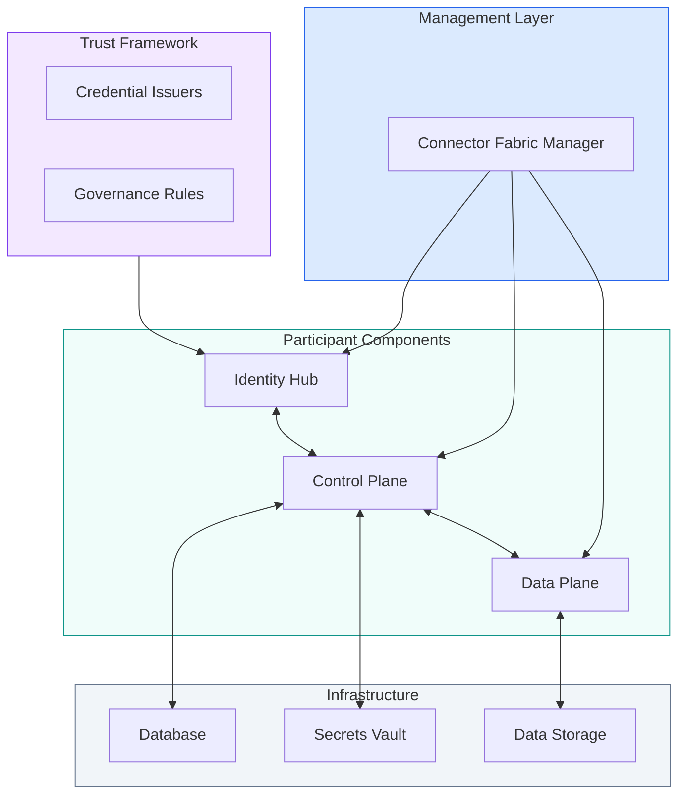
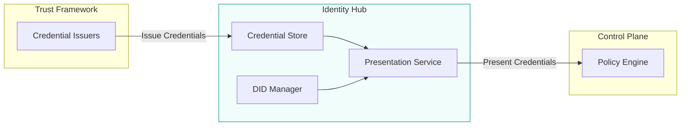
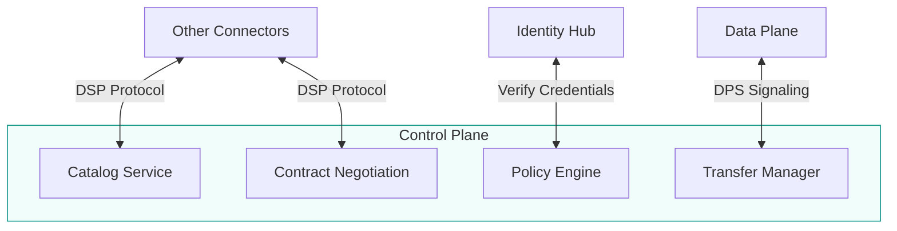
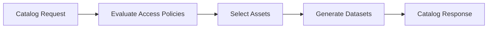
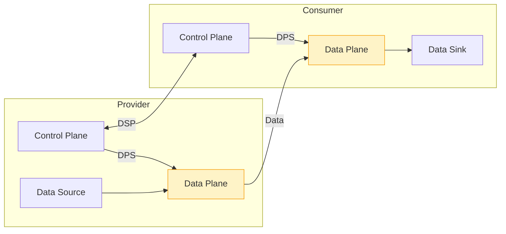
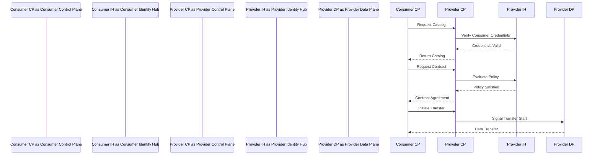
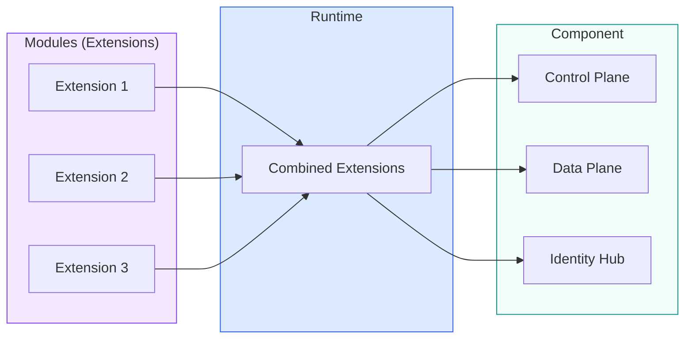

# Components Deep Dive

This page provides a detailed look at the components that enable trusted data sharing, with particular focus on the **Connector Fabric Manager (CFM)** as the management and orchestration layer.

---

## Component Architecture



---

## Connector Fabric Manager (CFM)

The CFM is the **orchestration and management layer** for multi-tenant dataspace deployments. It provisions trust infrastructure but is **NOT involved in runtime trust decisions**.

### What CFM Does

| Function | Description |
|----------|-------------|
| **Tenant lifecycle** | Create, update, delete participant contexts |
| **VPA provisioning** | Deploy and configure Control Planes, Data Planes, Identity Hubs |
| **DNS and networking** | Configure routing and endpoints for tenants |
| **Credential provisioning** | Set up Identity Hub entries and initial credentials |
| **Infrastructure orchestration** | Coordinate with Kubernetes, vaults, databases |

### What CFM Does NOT Do

| Function | Where It Happens |
|----------|------------------|
| **Trust decisions** | Control Plane VPAs |
| **Credential verification** | Control Plane VPAs |
| **Policy evaluation** | Control Plane VPAs |
| **Data transfer** | Data Plane VPAs |

**Critical insight:** CFM provisions and configures. Catalog queries, negotiations, and transfers happen directly in EDC services—no live dependency on CFM during data sharing.

### CFM Subsystems

```
┌─────────────────────────────────────────────────────────────────────────┐
│                    CONNECTOR FABRIC MANAGER (CFM)                        │
│                                                                          │
│  ┌─────────────────┐  ┌─────────────────┐  ┌─────────────────────────┐  │
│  │ Tenant Manager  │  │ Provision Mgr   │  │    Activity Agents      │  │
│  │ ───────────────│  │ ─────────────── │  │   ─────────────────────│  │
│  │ • REST API     │  │ • Orchestrations│  │   • K8s Agent           │  │
│  │ • State Store  │  │ • Workflows     │  │   • Vault Agent         │  │
│  │ • Virt. Model  │  │ • NATS comms    │  │     (credential store)  │  │
│  │ • Participant  │  │                 │  │   • DNS Agent           │  │
│  │   profiles     │  │                 │  │                         │  │
│  │ • DID binding  │  │                 │  │                         │  │
│  │ • Dataspace    │  │                 │  │                         │  │
│  │   profiles     │  │                 │  │                         │  │
│  └─────────────────┘  └─────────────────┘  └─────────────────────────┘  │
│                                                                          │
└────────┬─────────────────────┬─────────────────────────┬────────────────┘
         │                     │                         │
         │    ┌────────────────▼────────────┐           │
         │    │    NATS Jetstream           │           │
         │    │  (Reliable Messaging)       │           │
         │    └─────────────────────────────┘           │
         │                                              │
         └──────────────────▼───────────────────────────┘
                      Infrastructure
                 (K8s, Vault, DNS, DB)
```

#### Tenant Manager

The entry point for all CFM operations:

| Capability | Description |
|------------|-------------|
| **REST API** | CRUD operations for tenants, participants, VPAs |
| **State Store** | PostgreSQL-backed persistence |
| **Virtualization Model** | Tenants, Participant Profiles, VPAs, Cells |
| **Workflow Initiation** | Triggers provisioning workflows |

#### Provision Manager

Executes stateful orchestration workflows:

| Capability | Description |
|------------|-------------|
| **Orchestrations** | Multi-step provisioning workflows |
| **State Machine** | Track workflow progress, handle failures |
| **NATS Communication** | Reliable messaging with Activity Agents |
| **Rollback Support** | Undo partial provisioning on failure |

#### Activity Agents

Execute tasks, isolated from the provisioner for security:

| Agent | Responsibility |
|-------|---------------|
| **K8s Agent** | Deploy/configure Kubernetes resources |
| **Vault Agent** | Manage secrets, credentials, key pairs |
| **DNS Agent** | Configure DNS records, routing |

### CFM Architectural Decisions

| Decision | Rationale |
|----------|-----------|
| **Message-based** | NATS Jetstream for reliability and decoupling |
| **Activity Agents isolated** | Security: agents have infrastructure access, provisioner doesn't |
| **Stateful orchestrations** | Complex workflows with guaranteed completion |
| **No runtime dependency** | CFM failure doesn't affect data sharing |

### Trust in CFM Architecture

| Component | Trust Role |
|-----------|------------|
| **Control Plane** | Policy evaluation, credential verification, contract negotiation |
| **Data Plane** | Executes transfers according to agreed contracts (no trust logic) |
| **Identity Hub** | Stores/presents credentials, manages DIDs |
| **CFM** | Provisions trust infrastructure, NOT involved in runtime trust decisions |

---

## Identity Hub

The Identity Hub manages an organization's digital identity and is the **trust store** for credentials.

### Role in Trust Architecture



### Key Responsibilities

| Function | Description |
|----------|-------------|
| **DID Management** | Create and manage Decentralized Identifiers |
| **Credential Storage** | Store verifiable credentials received from issuers |
| **Presentation Service** | Create verifiable presentations when proving attributes |
| **Verification** | Validate credentials presented by other parties |

### Identity Hub APIs

| API | Purpose |
|-----|---------|
| **Identity API** | Manage credentials, key pairs, DID documents |
| **Presentation Exchange** | Request and create credential presentations |
| **Resolution Endpoints** | DID document resolution, DCP endpoints |

### Deployment Options

| Option | Description | Best For |
|--------|-------------|----------|
| **Dedicated** | Separate deployment | Production, security isolation |
| **Embedded** | Within connector process | Development, simple deployments |
| **Multi-tenant** | Shared runtime, isolated credentials | CFM-managed deployments |

[Learn more about Identity Hub →](/docs/architecture/identity-hub)

---

## Control Plane

The Control Plane handles the **business logic** of data sharing—catalogs, negotiation, and policy enforcement. This is where **trust decisions happen**.

### Role in Trust Architecture



### Key Responsibilities

| Function | Description | Trust Role |
|----------|-------------|------------|
| **Catalog Service** | Publish and discover data offerings | Access policy evaluation |
| **Contract Negotiation** | Negotiate terms between parties | Contract policy matching |
| **Policy Engine** | Evaluate policies against credentials | **Trust decisions** |
| **Transfer Manager** | Initiate and track transfers | Authorize based on agreements |

### Catalogs and Policies

Catalogs are **dynamically generated** based on the requester's credentials:



Different consumers may see different catalogs based on their credentials.

### Multi-Tenant Operation (EDC-V)

In CFM-managed deployments, the Control Plane serves multiple VPAs:

```
┌─────────────────────────────────────────────────────────────────┐
│              Virtual Control Plane (EDC-V)                       │
├─────────────────────────────────────────────────────────────────┤
│  ┌─────────────┐  ┌─────────────┐  ┌─────────────┐             │
│  │  Tenant A   │  │  Tenant B   │  │  Tenant C   │   ...       │
│  │  Context    │  │  Context    │  │  Context    │             │
│  └─────────────┘  └─────────────┘  └─────────────┘             │
│                                                                  │
│  ┌─────────────────────────────────────────────────────────┐    │
│  │              Shared Control Plane Runtime                │    │
│  └─────────────────────────────────────────────────────────┘    │
└─────────────────────────────────────────────────────────────────┘
```

Each tenant has isolated catalog, contracts, policies, and API paths.

[Learn more about Control Plane →](/docs/architecture/control-plane)

---

## Data Plane

The Data Plane executes **data transfers**—it's **trust-agnostic**, simply executing what the Control Plane agreed.

### Role in Trust Architecture



### Key Responsibilities

| Function | Description | Trust Role |
|----------|-------------|------------|
| **Transfer Execution** | Move data between parties | **None** (trust-agnostic) |
| **Protocol Support** | HTTP, S3, industrial protocols | N/A |
| **Token Validation** | Validate access tokens | Token issued by Control Plane |
| **Status Reporting** | Report to Control Plane | N/A |

### Why Trust-Agnostic?

The Data Plane doesn't evaluate policies or credentials. It:
1. Receives authorization from Control Plane
2. Validates tokens (issued by Control Plane)
3. Executes transfer
4. Reports completion

This separation enables:
- **Performance optimization** without trust overhead
- **Protocol-specific implementations**
- **Edge deployment** without full Control Plane

### Deployment Options

| Option | Description | Best For |
|--------|-------------|----------|
| **Embedded** | Within connector process | Development |
| **External** | Separate scalable service | Production |
| **Edge** | Close to data sources | Industrial, IoT |
| **Specialized** | Protocol-specific | OPC UA, streaming |

[Learn more about Data Plane →](/docs/architecture/data-plane)

---

## Issuer Service

The Issuer Service enables organizations to **issue credentials** to other participants, becoming a **trust anchor**.

### Key Capabilities

| Capability | Description |
|------------|-------------|
| **Credential Definitions** | Define the shape of credentials with claim mappings |
| **Attestation Sources** | Gather claims from databases or presentations |
| **Status Lists** | Track revoked/suspended credentials (BitStringStatusList) |
| **Asynchronous Issuance** | Process requests and deliver credentials to holder's Storage API |

### When to Deploy

| Scenario | Need Issuer Service? |
|----------|---------------------|
| **Standard participant** | No—receive credentials from external issuers |
| **Dataspace operator** | Yes—issue membership credentials |
| **Certification body** | Yes—issue compliance credentials |
| **Consortium leader** | Yes—issue role credentials |

---

## Federated Catalog

The Federated Catalog aggregates and caches catalogs from multiple providers:

### Key Capabilities

| Capability | Description |
|------------|-------------|
| **Catalog Crawling** | Periodically fetch catalogs from known providers |
| **Caching** | Store catalog data locally for fast querying |
| **Aggregation** | Combine multiple provider catalogs |
| **Search** | Enable discovery across the dataspace |

### Use Cases

| Scenario | Benefit |
|----------|---------|
| Large dataspaces | Avoid querying each provider individually |
| Offline access | Query cached catalogs when providers unavailable |
| Discovery portals | Power user-facing catalog search interfaces |

---

## Component Interaction

Here's how components interact during a typical data sharing flow:



---

## Modules, Runtimes, and Components

EDC is built on a **module system** that contributes features as extensions to a runtime:



### Identifier Types

| Identifier | Scope | Lifecycle |
|------------|-------|-----------|
| **Participant ID** | Organization's identity (often Web DID) | Permanent, shared across all runtimes |
| **Component ID** | Specific deployment (e.g., a CP cluster) | Permanent, survives restarts |
| **Runtime ID** | Individual runtime instance | Ephemeral, does not survive restarts |

---

## Infrastructure Requirements

### Control Plane
- **Compute:** 2-4 vCPUs, 4-8 GB RAM
- **Storage:** PostgreSQL or compatible database
- **Network:** HTTPS endpoints, TLS certificates

### Identity Hub
- **Compute:** 1-2 vCPUs, 2-4 GB RAM
- **Storage:** Credential store
- **Network:** DID resolution endpoints

### Data Plane
- **Compute:** Scales with transfer volume
- **Storage:** Temporary buffer space
- **Network:** High bandwidth, protocol-specific ports

### Connector Fabric Manager
- **Compute:** 2-4 vCPUs, 4-8 GB RAM
- **Storage:** PostgreSQL database
- **Messaging:** NATS Jetstream (default)
- **Network:** Access to cloud APIs, Kubernetes

---

## What's Next

- **[Identity Hub](/docs/architecture/identity-hub)** — Decentralized identity and credentials
- **[Control Plane](/docs/architecture/control-plane)** — Contract negotiation and policies
- **[Data Plane](/docs/architecture/data-plane)** — Data transfer execution
- **[Protocols](/docs/architecture/protocols)** — DSP, DCP, and DPS specifications
- **[Deployment Topologies](/docs/architecture/deployment-topologies)** — Cloud, edge, and hybrid options
