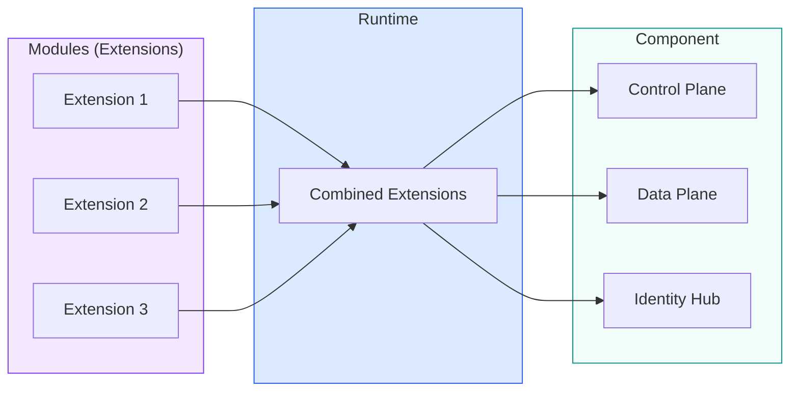
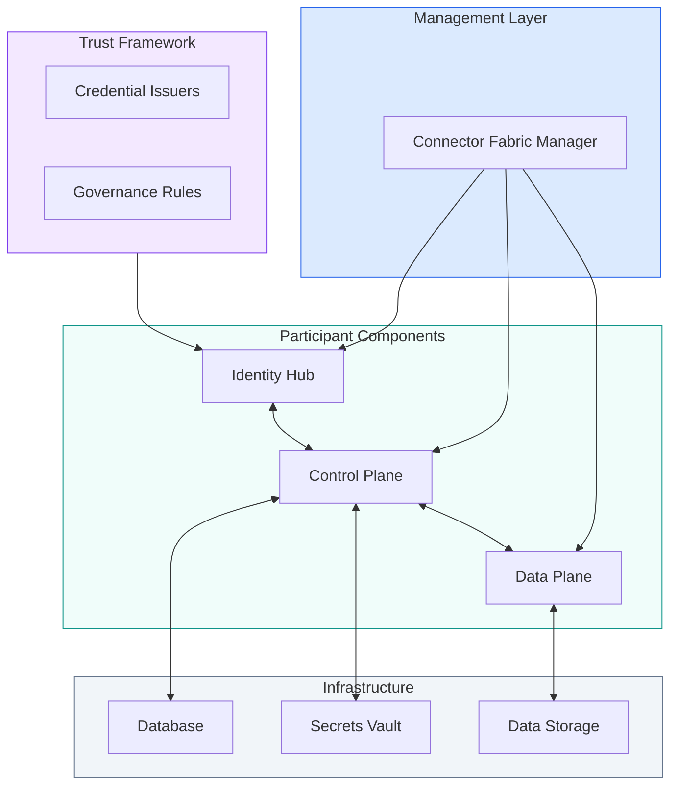
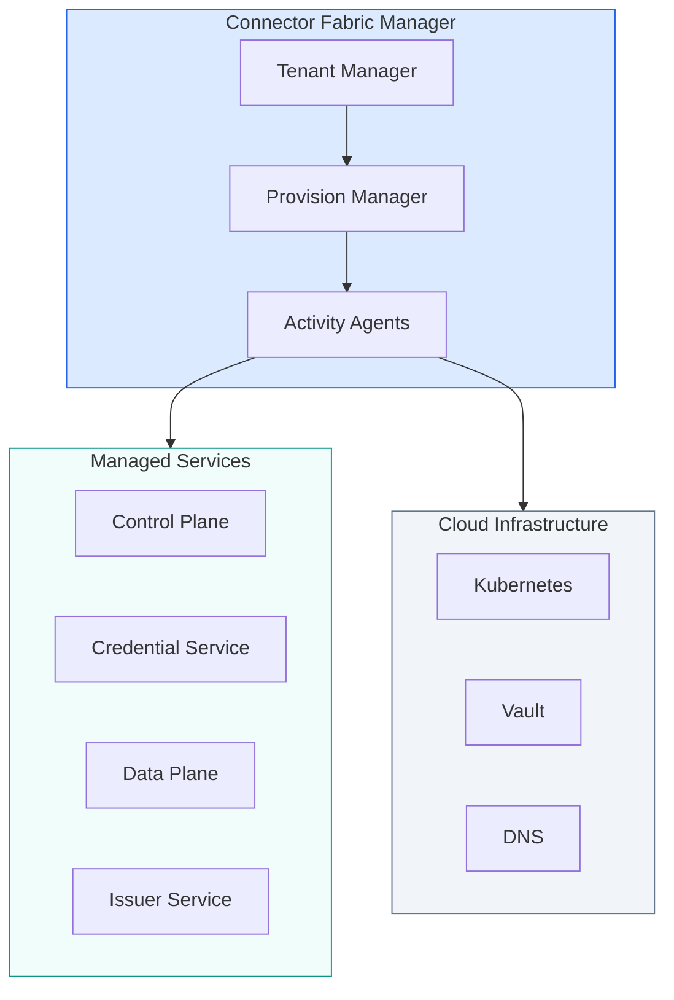
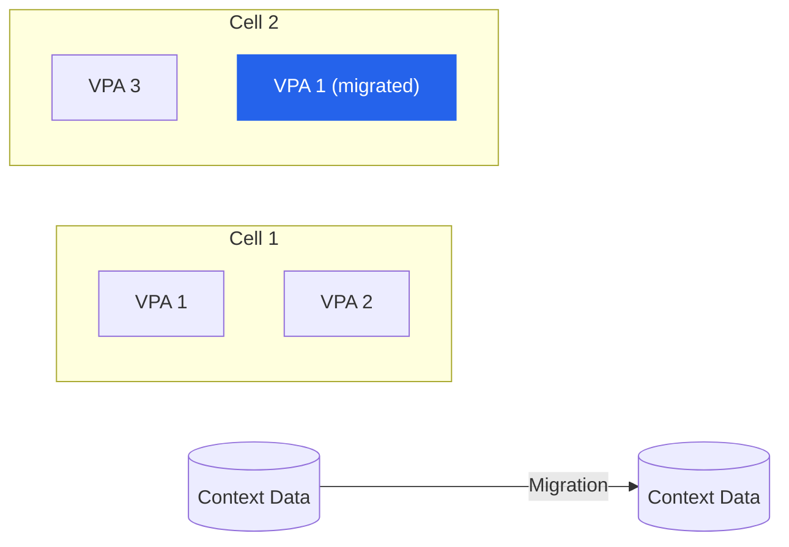
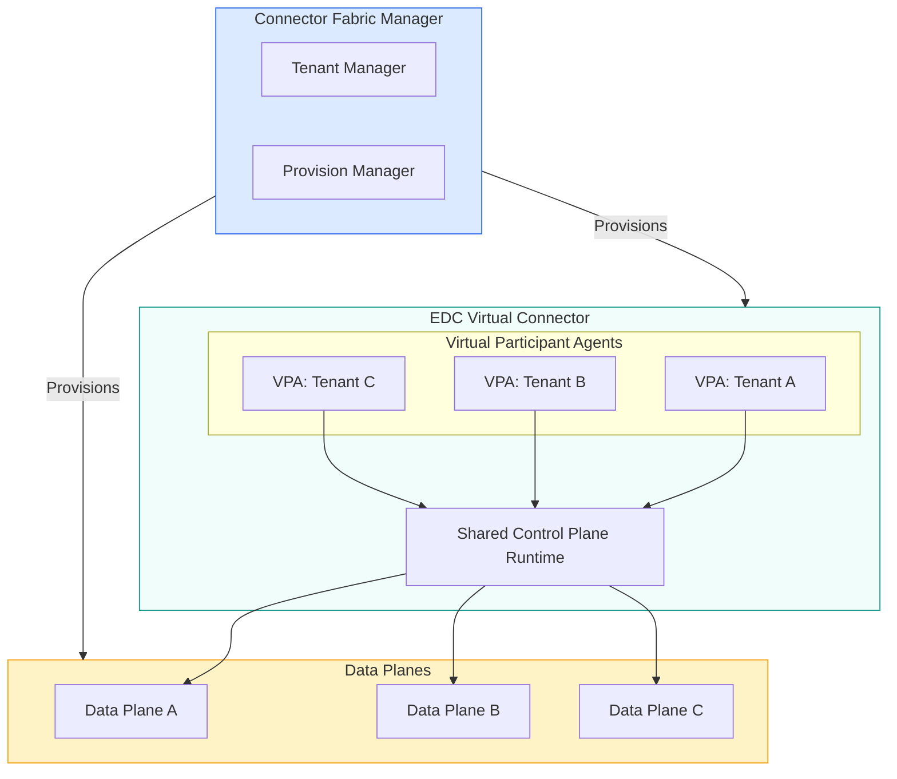
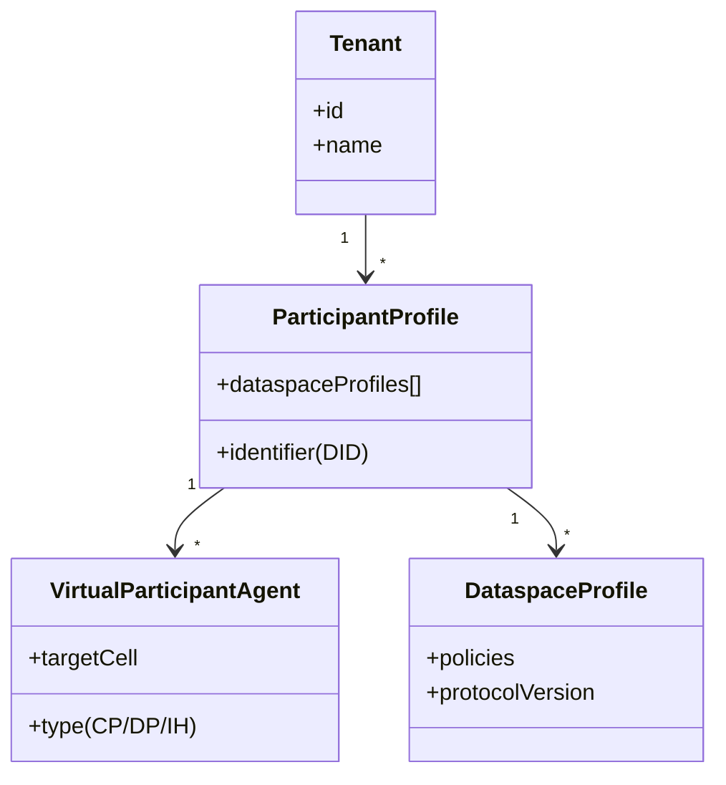
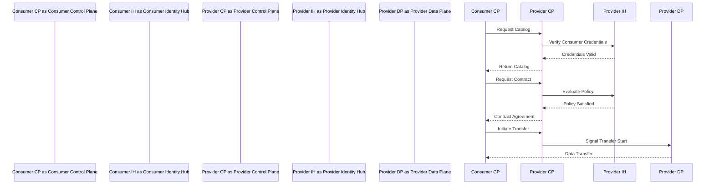

# Dataspace Components

An overview of the essential components that make up a dataspace deployment.

This page provides a high-level overview of the essential components that enable trusted data sharing. Each component serves a specific purpose in the architecture.

## Modules, Runtimes, and Components

EDC is built on a **module system** that contributes features as extensions to a runtime. Runtimes are assembled to create a *component* such as a control plane, data plane, or identity hub. A component may be composed of a single runtime or a set of clustered runtimes:

### Identifier Types

EDC uses three identifier types based on this architecture:

| Identifier | Scope | Lifecycle |
|------------|-------|-----------|
| **Participant ID** | Organization's identity in the dataspace (often a Web DID) | Permanent, shared across all runtimes |
| **Component ID** | Specific component deployment (e.g., a control plane cluster) | Permanent, survives restarts |
| **Runtime ID** | Individual runtime instance | Ephemeral, does not survive restarts |

All runtimes of all components operated by an organization use the **same participant ID**. Component IDs distinguish between deployments (e.g., two data planes across separate clusters). Runtime IDs are used internally for cluster locks and tracing.

---

---

## Core Components

A dataspace deployment consists of multiple layers: trust framework, management, participant components, and infrastructure. Here's a brief overview:

### Trust Framework Components

Define the rules and establish trust across the dataspace:

| Component | Purpose |
|-----------|---------|
| **Credential Issuers** | Trusted organizations that issue verifiable credentials to participants |
| **Trust Registries** | Lists of authorized issuers and valid credential types |
| **Governance Rules** | Policies and requirements for dataspace participation |

### Management Components

Orchestrate and manage dataspace deployments:

| Component | Purpose |
|-----------|---------|
| **Connector Fabric Manager (CFM)** | Platform for deploying and managing dataspace resources in multi-tenant environments |
| **Tenant Manager** | Manages tenancy data and initiates deployment processes |
| **Provision Manager** | Executes orchestrations that configure services and infrastructure |

### Participant Components

Run by each organization participating in the dataspace:

| Component | Purpose |
|-----------|---------|
| **Identity Hub** | Manages DIDs and verifiable credentials for establishing trust |
| **Control Plane** | Handles catalog, contract negotiation, and policy enforcement |
| **Data Plane** | Executes actual data transfers between parties |
| **Federated Catalog** | Aggregates and caches catalogs from multiple providers (optional) |

### Infrastructure Components

Support the operation of dataspace components:

| Component | Purpose |
|-----------|---------|
| **Database** | Stores state for contracts, transfers, and configuration |
| **Secrets Vault** | Manages cryptographic keys and sensitive credentials |
| **Observability Stack** | Provides monitoring, logging, and alerting |

---

## Trust Framework Components

The trust framework establishes the rules that govern a dataspace. It's typically managed by a dataspace operator or industry consortium.

### Issuer Service

The Issuer Service is responsible for issuing verifiable credentials to entities within the dataspace using the Decentralized Claims Protocol (DCP):

- Issue membership credentials when organizations join the dataspace
- Issue role credentials (supplier, auditor, emergency responder)
- Issue certification credentials (ISO, compliance attestations)
- Manage credential lifecycle (issuance, renewal, revocation)

**Key capabilities:**

| Capability | Description |
|------------|-------------|
| **Credential Definitions** | Define the shape of credentials with claim mappings |
| **Attestation Sources** | Gather claims from databases or presentations |
| **Status Lists** | Track revoked/suspended credentials (BitStringStatusList) |
| **Asynchronous Issuance** | Process requests and deliver credentials to holder's Storage API |

The Issuer Service supports both **preconfigured holders** (organizations that undergo onboarding) and **anonymous requests** (for open dataspaces where pre-registration isn't required).

### Trust Registries

Maintain lists of trusted issuers and credential schemas:

- Define which issuers can issue which credential types
- Publish credential schemas that define required attributes
- Track revocation status of credentials

### Governance Policies

Define the rules of participation:

- Membership criteria for joining the dataspace
- Required credentials for specific data access
- Compliance requirements and audit procedures

---

## Management Components

For service providers running dataspace infrastructure at scale, management components orchestrate deployment and operations.

### Connector Fabric Manager (CFM)

The CFM is a platform for deploying and managing dataspace resources in a multi-tenant environment:

**CFM Subsystems:**

| Subsystem | Purpose |
|-----------|---------|
| **Tenant Manager** | Manages tenant data and initiates provisioning workflows |
| **Provision Manager** | Executes stateful orchestrations for configuring services |
| **Activity Agents** | Execute tasks asynchronously, isolated from the provisioner |

**Key capabilities:**

- **Tenant lifecycle management** — Create, update, and delete participant contexts
- **DNS and networking** — Configure routing and endpoints for tenants
- **Credential provisioning** — Set up Identity Hub entries and initial credentials
- **Infrastructure orchestration** — Coordinate with Kubernetes, vaults, and databases

### Service Virtualization

The CFM implements **service virtualization** — a single software deployment serves multiple participants through configuration-based isolation:

**Why configuration-based, not process-based:**

| Approach | Description | Trade-off |
|----------|-------------|-----------|
| **Process-based** | Spin up separate processes per tenant | Not scalable, inefficient |
| **Configuration-based** | Write VPA metadata to store, create isolation contexts on-the-fly | Efficient, enables migration |

This enables:
- Efficient resource utilization
- Easy context migration between cells
- Horizontal scaling without per-tenant overhead

---

## Participant Components

Each organization in the dataspace runs these components to participate in data sharing.

### Identity Hub

The Identity Hub manages an organization's digital identity:

- **DID Management** — Creates and manages Decentralized Identifiers
- **Credential Storage** — Stores verifiable credentials received from issuers
- **Presentation Service** — Creates verifiable presentations for proving attributes
- **Verification** — Validates credentials presented by other parties

The Identity Hub implements the Decentralized Claims Protocol (DCP) for interoperable credential exchange.

**Key APIs:**
- Identity API for managing credentials, key pairs, and DID documents
- Presentation Exchange for credential requests and responses

[Learn more about Identity Hub →](/docs/architecture/identity-hub)

### Control Plane

The Control Plane handles the business logic of data sharing:

- **Catalog Service** — Publishes and discovers data offerings
- **Contract Negotiation** — Negotiates terms between provider and consumer
- **Policy Engine** — Evaluates access policies against credentials
- **Transfer Process Manager** — Initiates and tracks data transfers

The Control Plane implements the Dataspace Protocol (DSP) for interoperable negotiation and discovery.

**Key APIs:**
- Management API for configuring assets, policies, and contracts
- DSP API for connector-to-connector communication

[Learn more about Control Plane →](/docs/architecture/control-plane)

### Data Plane

The Data Plane executes the actual movement of data:

- **Transfer Execution** — Moves data between provider and consumer
- **Protocol Support** — HTTP, S3, Azure Blob, industrial protocols
- **Access Enforcement** — Validates tokens before allowing access
- **Flow Control** — Manages transfer lifecycle (start, suspend, complete)

The Data Plane communicates with the Control Plane via Data Plane Signaling (DPS).

**Key features:**
- Pluggable transfer protocols
- Horizontal scaling for high throughput
- Edge deployment for low latency

[Learn more about Data Plane →](/docs/architecture/data-plane)

### Federated Catalog (Optional)

The Federated Catalog is an optional component that aggregates and caches catalogs from multiple data providers:

- **Catalog Crawling** — Periodically fetches catalogs from known providers
- **Caching** — Stores catalog data locally for fast querying
- **Aggregation** — Combines multiple provider catalogs into a unified view
- **Search** — Enables discovery across the dataspace

**Use cases:**

| Scenario | Benefit |
|----------|---------|
| Large dataspaces | Avoid querying each provider individually |
| Offline access | Query cached catalogs when providers are unavailable |
| Discovery portals | Power user-facing catalog search interfaces |

The Federated Catalog is typically deployed alongside the Control Plane but can run as a separate component.

---

## Multi-Tenant Architecture (EDC-V)

For cloud service providers hosting multiple organizations, the **Virtual Connector (EDC-V)** provides multi-tenant operation, orchestrated by the CFM:

### Service Virtualization Model

The EDC-V architecture is based on a service virtualization model:

| Concept | Description |
|---------|-------------|
| **Tenant** | Organization participating in one or more dataspaces |
| **Participant Profile** | Links a tenant's identifier (DID) to dataspace memberships |
| **Virtual Participant Agent (VPA)** | Unit of deployment—a control plane, data plane, or identity hub context |
| **Dataspace Profile** | Configuration for a specific dataspace (policies, protocol version) |
| **Cell** | Homogenous deployment zone (e.g., a Kubernetes cluster) |

### EDC-V Components

| Component | Shared/Isolated |
|-----------|-----------------|
| Control Plane Runtime | Shared |
| Virtual Participant Agent | Isolated per tenant |
| Identity Hub | Shared runtime, isolated credentials |
| Data Plane | Isolated per tenant |
| Database | Shared with tenant isolation |

### Benefits

| Benefit | Description |
|---------|-------------|
| **Efficiency** | Share infrastructure costs across tenants |
| **Operations** | Centralized updates and monitoring via CFM |
| **Scalability** | Add tenants without new infrastructure |
| **Isolation** | Strict boundaries between VPAs |
| **Migration** | Move VPAs between cells by moving configuration |

[Learn more about Deployment Topologies →](/docs/architecture/deployment-topologies)

---

## Component Interaction

Here's how components interact during a typical data sharing flow:

---

## Infrastructure Requirements

### Control Plane
- **Compute:** 2-4 vCPUs, 4-8 GB RAM
- **Storage:** PostgreSQL or compatible database
- **Network:** HTTPS endpoints, TLS certificates

### Identity Hub
- **Compute:** 1-2 vCPUs, 2-4 GB RAM  
- **Storage:** Credential store
- **Network:** DID resolution endpoints

### Data Plane
- **Compute:** Scales with transfer volume
- **Storage:** Temporary buffer space
- **Network:** High bandwidth, protocol-specific ports

### Connector Fabric Manager
- **Compute:** 2-4 vCPUs, 4-8 GB RAM
- **Storage:** PostgreSQL database
- **Messaging:** NATS Jetstream (default)
- **Network:** Access to cloud APIs, Kubernetes

---

## What's Next

Learn more about each component:

- **[Identity Hub](/docs/architecture/identity-hub)** — Decentralized identity and credentials
- **[Control Plane](/docs/architecture/control-plane)** — Contract negotiation and policies
- **[Data Plane](/docs/architecture/data-plane)** — Data transfer execution
- **[Protocols](/docs/architecture/protocols)** — DSP, DCP, and DPS specifications
- **[Deployment Topologies](/docs/architecture/deployment-topologies)** — Cloud, edge, and hybrid options
