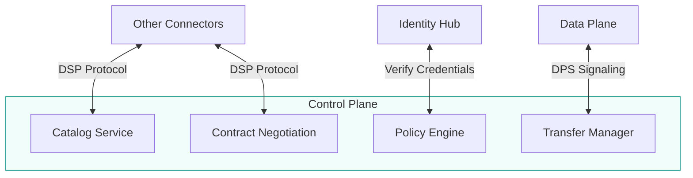
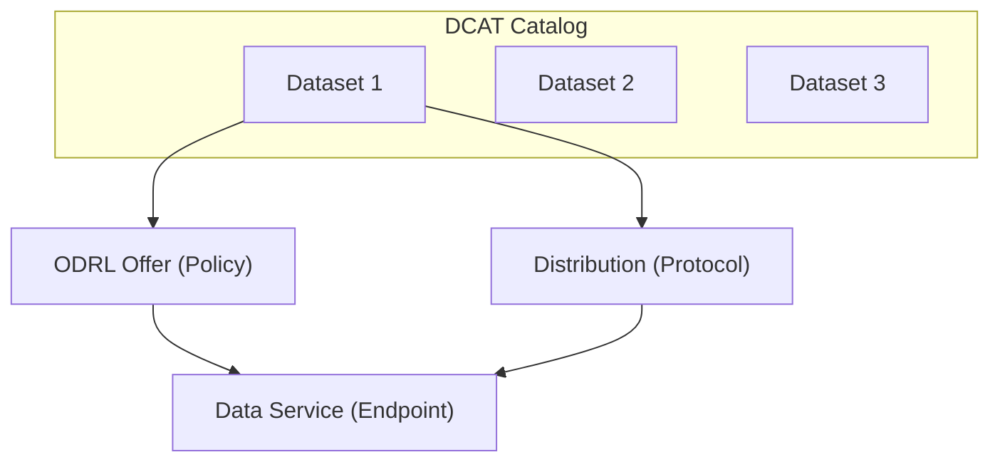
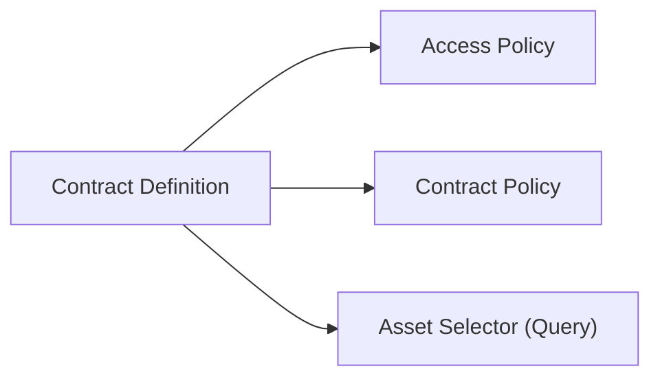
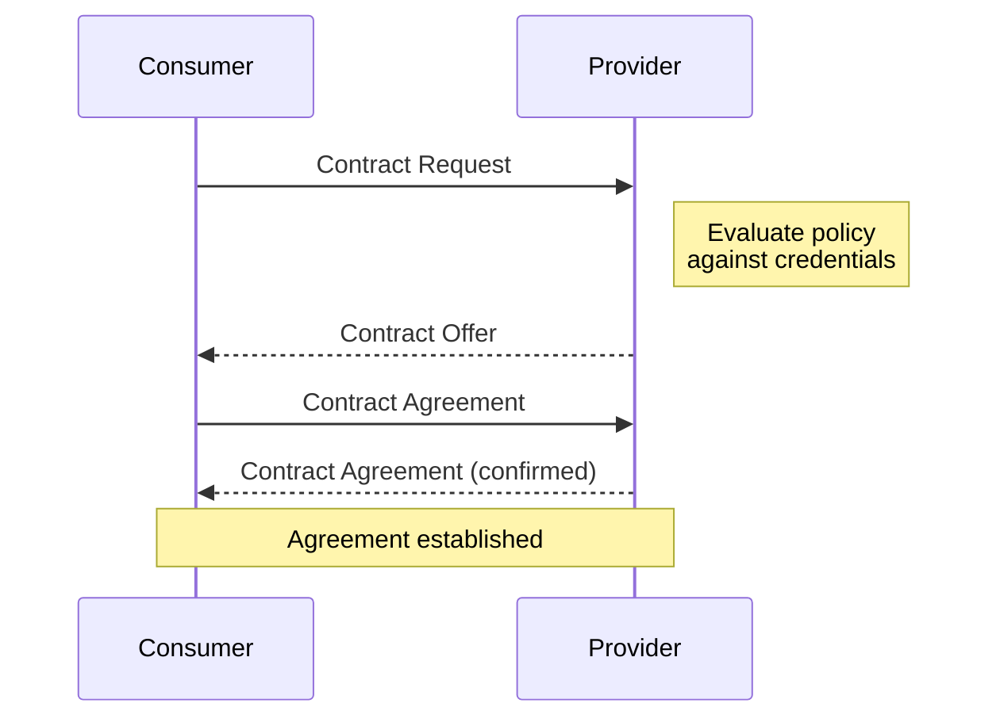
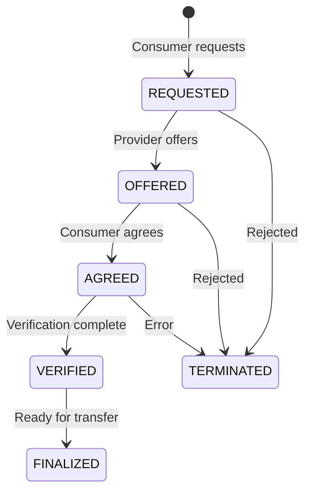
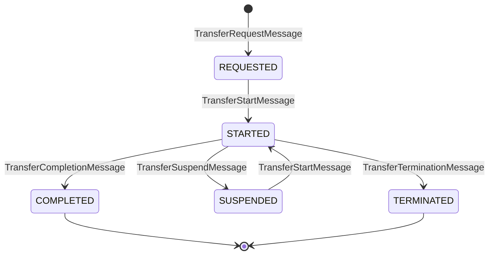
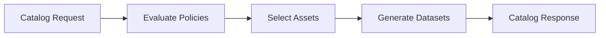
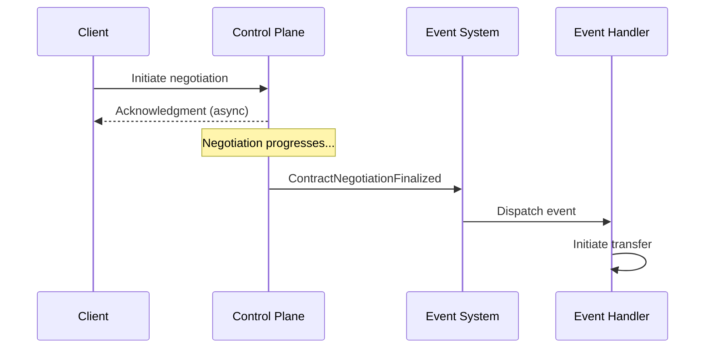

# Control Plane

The Control Plane handles the business logic of data sharing. It manages catalogs, negotiates contracts, and enforces policies—all before any data moves. This separation of concerns keeps business logic distinct from data transfer mechanics.

---

## Role in the Architecture

The Control Plane is the central coordination point for data sharing:



**Key responsibilities:**

- Publish and discover data offerings via catalogs
- Negotiate contracts between provider and consumer
- Evaluate access policies against credentials
- Initiate and track data transfers

---

## Key Concepts

### Catalogs, Datasets, and Offers

When a consumer requests a catalog from a provider, the provider returns a **DCAT Catalog** containing **Datasets**:



| Element | Description |
|---------|-------------|
| **Dataset** | Represents data the provider offers to the requesting consumer |
| **Offer** | An ODRL policy defining usage requirements (duties, rights, obligations) |
| **Distribution** | Describes how to obtain the data (wire protocol, e.g., HTTP-PULL, S3-PUSH) |
| **Data Service** | The endpoint where a contract can be negotiated |

**Important:** Catalogs are **not static documents**. They are dynamically generated at runtime based on the consumer's identity and credentials. Different consumers may see different datasets.

### Assets vs. Datasets

Internally, providers manage **Assets**—data descriptors loaded via the Management API:

| Concept | Description |
|---------|-------------|
| **Asset** | Internal descriptor of data (stored in EDC) |
| **Dataset** | External representation in DSP catalog (generated from assets) |

Assets are **not** the actual data—they are descriptors that point to where data resides via a **DataAddress**. When a catalog request is received, assets are transformed into datasets based on contract definitions.

### Contract Definitions

Contract definitions **link assets and policies** by declaring which policies apply to which assets:



| Policy Type | Purpose | Visible to Consumer? |
|-------------|---------|---------------------|
| **Access Policy** | Determines if consumer can see the asset | No (evaluated internally) |
| **Contract Policy** | Terms that apply during the agreement | Yes (in offer) |

This decoupling allows policies to be created by specialists and reused across assets.

### Contract Negotiation

A structured protocol between provider and consumer:



### Policies

Machine-readable rules that govern access:

| Policy Type | Example |
|-------------|---------|
| **Who can access** | Must hold "MembershipCredential" |
| **What they can do** | Read only, no redistribution |
| **Time constraints** | Valid until 2025-12-31 |
| **Purpose constraints** | Only for "quality-assurance" purpose |

### Contract Agreement

The binding record of negotiated terms:

- References the specific asset and policy
- Signed by both parties
- Used to authorize subsequent transfers
- Logged for audit and compliance

---

## The Dataspace Protocol (DSP)

The Control Plane implements the Dataspace Protocol for interoperable communication:

### Catalog Protocol

```
GET /catalog/request
```

- Query available offerings from a provider
- Filter by asset type, properties, or policies
- Support for federated catalog across multiple providers

### Contract Negotiation Protocol

State machine for negotiating terms:



| State | Description |
|-------|-------------|
| `REQUESTED` | Consumer has requested negotiation |
| `OFFERED` | Provider has made an offer |
| `AGREED` | Both parties have agreed |
| `VERIFIED` | Agreement has been verified |
| `FINALIZED` | Negotiation complete, ready for transfer |
| `TERMINATED` | Negotiation failed or was canceled |

### Transfer Process Protocol

After agreement, initiate data transfer. The Transfer Process models consumer access to a provider dataset:



| State | Description |
|-------|-------------|
| `REQUESTED` | Consumer has requested a data transfer |
| `STARTED` | Data is available (pull) or being sent (push) |
| `SUSPENDED` | Transfer temporarily paused |
| `COMPLETED` | Finite transfer completed successfully (terminal) |
| `TERMINATED` | Transfer ended before completion (terminal) |

#### Finite vs. Non-Finite Transfers

| Type | Description | Completion |
|------|-------------|------------|
| **Finite** | Data has a demarcated end (file, dataset) | Transitions to COMPLETED |
| **Non-Finite** | No specified end (stream, API access) | Remains in STARTED until TERMINATED |

:::tip Non-Finite Transfers
A non-finite transfer can remain in the STARTED state indefinitely—for hours, days, or months. This enables ongoing API access or data streaming under a single contract agreement.
:::

---

## Catalog Generation

When a consumer requests a catalog, the provider dynamically generates it:

1. **Retrieve contract definitions** and evaluate access/contract policies against consumer claims
2. **Execute asset selector queries** from passing contract definitions
3. **Create datasets** by combining assets with contract policies
4. **Return catalog** with datasets the consumer can access



### Asset Modeling Best Practices

:::caution Asset Granularity Matters
Do **not** model each piece of data as a separate asset. This creates excessive contract negotiations and transfer processes.
:::

| Scenario | Bad Approach | Good Approach |
|----------|--------------|---------------|
| Parts catalog | One asset per part (millions) | One asset for all parts or by category |
| Sensor data | One asset per reading | One streaming asset per sensor type |
| API access | One asset per endpoint | One asset for the entire API |

**Key principle:** Model assets to represent **aggregate data** or data categories. Use a single contract negotiation and keep transfer processes open for ongoing access (non-finite transfers).

### Contract Definition Best Practices

- **Limit contract definitions** to a reasonable number
- Use them to **filter groups of assets**, not individual assets
- Add **custom asset properties** as selection labels for efficient querying

---

## Policy Types

### Access Policies

Control who can see an asset in the catalog and initiate negotiation:

```json
{
  "@type": "PolicyDefinition",
  "policy": {
    "permission": [{
      "action": "use",
      "constraint": [{
        "leftOperand": "MembershipCredential",
        "operator": "eq",
        "rightOperand": "active"
      }]
    }]
  }
}
```

### Contract Policies

Terms that apply during the agreement:

```json
{
  "permission": [{
    "action": "use",
    "constraint": [{
      "leftOperand": "purpose",
      "operator": "eq",
      "rightOperand": "quality-assurance"
    }]
  }],
  "prohibition": [{
    "action": "distribute"
  }]
}
```

### ODRL Vocabulary

Policies use the Open Digital Rights Language (ODRL) for expressing constraints:

| Operator | Meaning |
|----------|---------|
| `eq` | Equals |
| `neq` | Not equals |
| `lt` / `gt` | Less than / Greater than |
| `in` | In set |
| `hasPart` | Contains |

---

## Management API

The Control Plane exposes a Management API for configuration:

### Asset Management

```http
POST /v3/assets
{
  "@id": "product-catalog-api",
  "properties": {
    "name": "Product Catalog",
    "contenttype": "application/json"
  },
  "dataAddress": {
    "type": "HttpData",
    "baseUrl": "https://api.example.com/catalog"
  }
}
```

### Policy Definition

```http
POST /v3/policydefinitions
{
  "@id": "membership-required",
  "policy": {
    "permission": [{
      "action": "use",
      "constraint": [...]
    }]
  }
}
```

### Contract Definition

```http
POST /v3/contractdefinitions
{
  "@id": "catalog-access",
  "accessPolicyId": "membership-required",
  "contractPolicyId": "standard-terms",
  "assetsSelector": {
    "operandLeft": "id",
    "operator": "=",
    "operandRight": "product-catalog-api"
  }
}
```

---

## Architecture Details

```
┌─────────────────────────────────────────────────────────────┐
│                       Control Plane                          │
├─────────────────────────────────────────────────────────────┤
│                                                              │
│  ┌──────────────┐  ┌──────────────┐  ┌──────────────────┐   │
│  │   Catalog    │  │   Contract   │  │     Policy       │   │
│  │   Service    │  │   Service    │  │     Engine       │   │
│  └──────────────┘  └──────────────┘  └──────────────────┘   │
│                                                              │
│  ┌──────────────┐  ┌──────────────┐  ┌──────────────────┐   │
│  │   Transfer   │  │    State     │  │    Dispatcher    │   │
│  │   Manager    │  │    Store     │  │    (Events)      │   │
│  └──────────────┘  └──────────────┘  └──────────────────┘   │
│                                                              │
├─────────────────────────────────────────────────────────────┤
│                      External Interfaces                     │
│  • DSP API (connector-to-connector)                          │
│  • Management API (configuration)                            │
│  • Identity Hub (credential verification)                    │
│  • Data Plane (transfer signaling via DPS)                   │
└─────────────────────────────────────────────────────────────┘
```

### State Management

The Control Plane maintains state for:

- **Contract negotiations** — Track negotiation progress
- **Contract agreements** — Store agreed terms
- **Transfer processes** — Track transfer lifecycle

State is persisted to a database (PostgreSQL, CosmosDB, etc.) for durability and recovery.

---

## Multi-Tenant Operation (EDC-V)

In EDC-V deployments, the Control Plane serves multiple participant contexts:

```
┌─────────────────────────────────────────────────────────────┐
│              Virtual Control Plane (EDC-V)                   │
├─────────────────────────────────────────────────────────────┤
│  ┌─────────────┐  ┌─────────────┐  ┌─────────────┐         │
│  │  Tenant A   │  │  Tenant B   │  │  Tenant C   │   ...   │
│  │  Context    │  │  Context    │  │  Context    │         │
│  └─────────────┘  └─────────────┘  └─────────────┘         │
│                                                              │
│  ┌─────────────────────────────────────────────────────┐    │
│  │              Shared Control Plane Runtime            │    │
│  └─────────────────────────────────────────────────────┘    │
└─────────────────────────────────────────────────────────────┘
```

Each tenant has:
- Isolated catalog and contracts
- Separate policies and assets
- Dedicated API paths (`/participants/{participantId}/...`)

---

## Asynchronous Operations and Reliable Messaging

DSP and EDC are based on **asynchronous messaging**. Contract negotiations and transfer processes are not completed immediately—they progress through state machines over time.

### Working with Asynchronous Messaging

:::caution Don't Block on Negotiations
Do not create a synchronous API wrapper that blocks until a negotiation completes. This breaks EDC's reliability guarantees and creates incorrect, inefficient code.
:::

The correct approach is to use **events**:



### Reliable Messaging

EDC implements reliable messaging for all DSP interactions:

| Property | Description |
|----------|-------------|
| **Unique IDs** | All messages have unique identifiers |
| **Idempotent** | Duplicate messages are handled safely |
| **Transactional** | State transitions committed only after acknowledgment |
| **Persistent** | State survives restarts |

If a message is not acknowledged, it will be resent. If a runtime crashes, pending messages are resent on recovery (or by another instance in a cluster).

---

## Key Benefits

| Benefit | Description |
|---------|-------------|
| **Separation of concerns** | Business logic separate from data movement |
| **Auditability** | All negotiations logged for compliance |
| **Policy enforcement** | Rules checked automatically |
| **Interoperability** | Standard DSP protocol across implementations |
| **Scalability** | Lightweight compared to data plane |
| **Reliability** | Transactional state management |

---

## What's Next

- **[Protocols](/docs/architecture/protocols)** — Deep dive into DSP, DCP, and DPS specifications
- **[Data Plane](/docs/architecture/data-plane)** — How data actually moves after negotiation
- **[Identity Hub](/docs/architecture/identity-hub)** — How credentials enable policy evaluation
- **[Components Overview](/docs/architecture/components)** — See how Control Plane fits in the architecture
