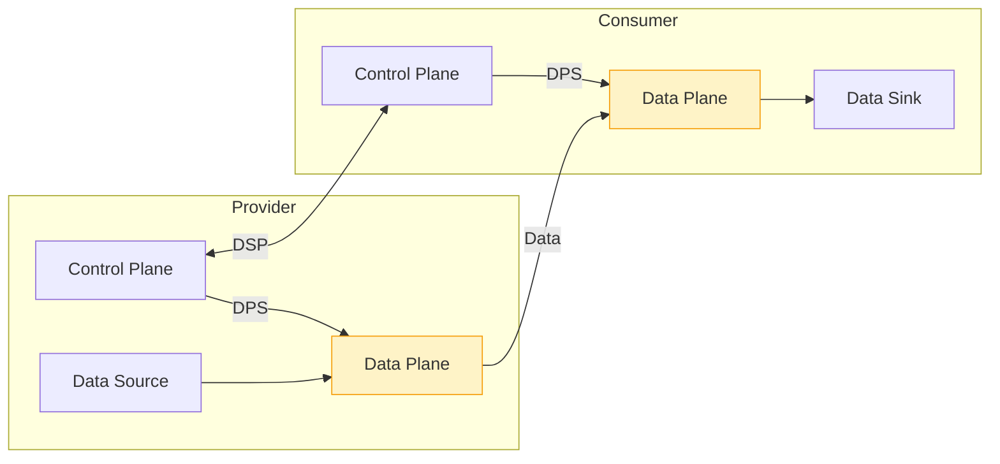
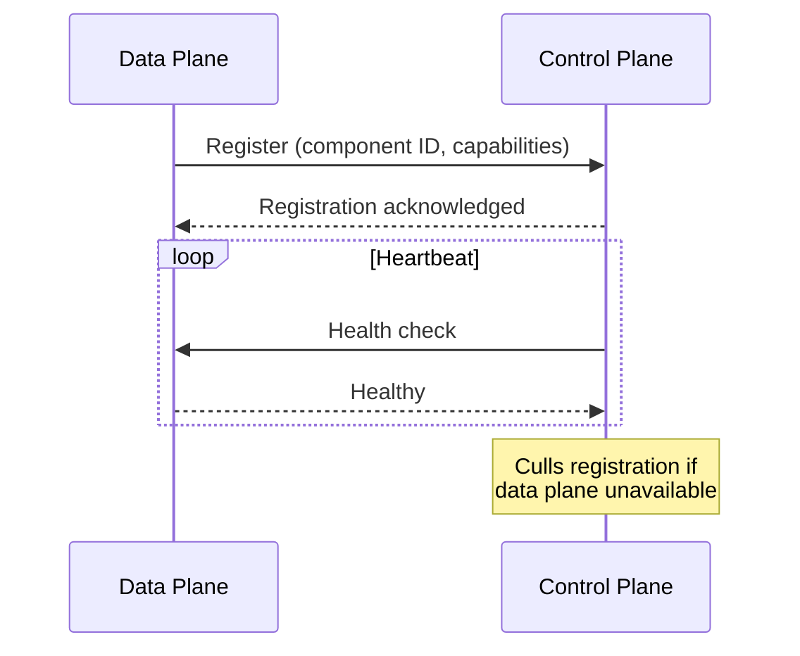
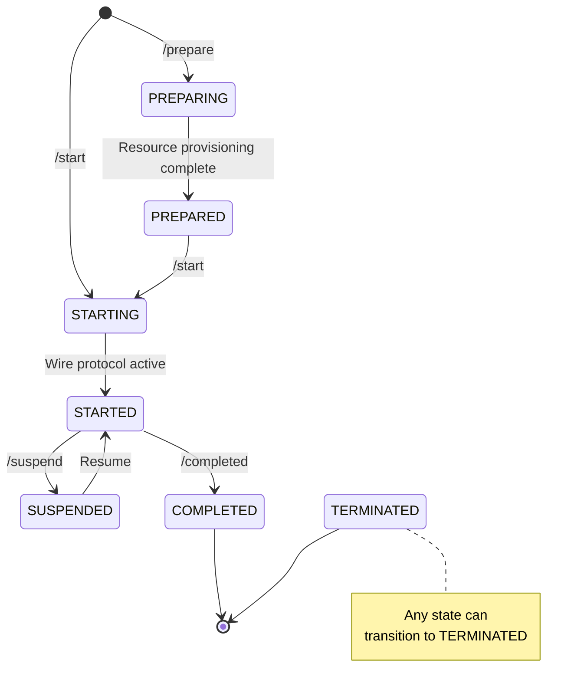
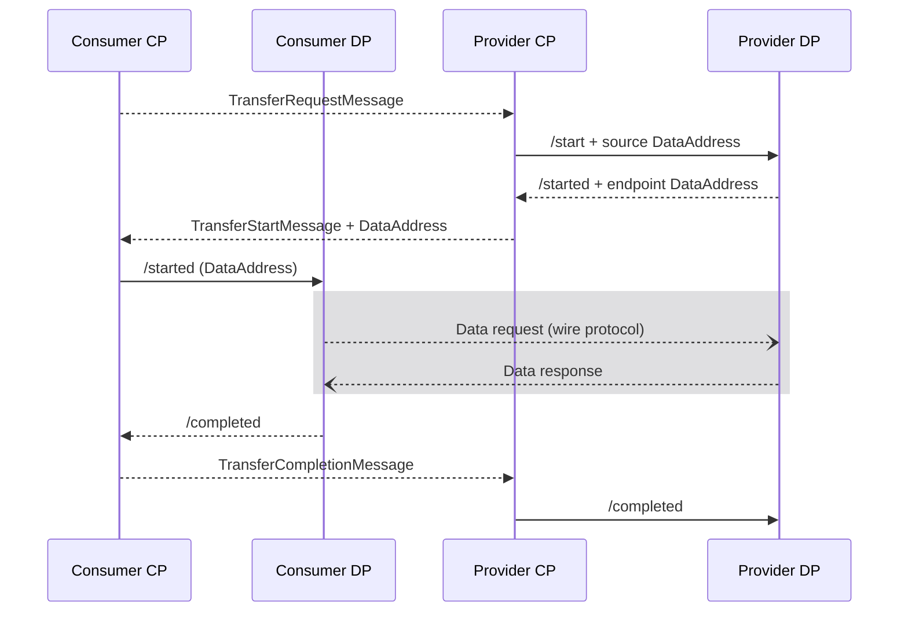
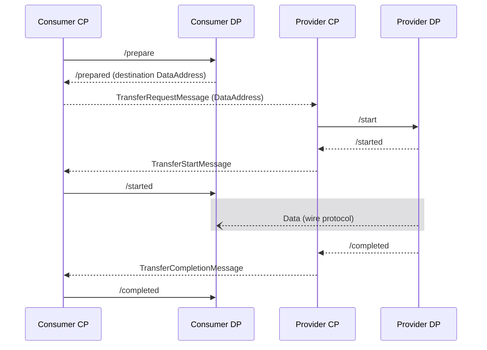
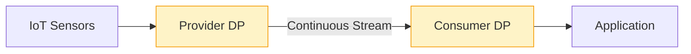
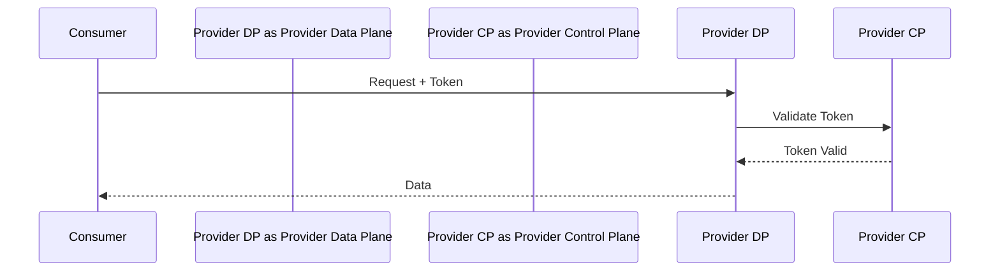

# Data Plane

The Data Plane handles the actual movement of data between parties. After the Control Plane negotiates and agrees on terms, the Data Plane executes the transfer securely and efficiently.

---

## Role in the Architecture

The Data Plane operates under the direction of the Control Plane:



**Key responsibilities:**

- Execute data transfers between provider and consumer
- Support multiple transfer protocols (HTTP, S3, industrial)
- Enforce access tokens tied to contract agreements
- Report transfer status back to Control Plane

---

## Why Separate the Data Plane?

The Control Plane and Data Plane are deliberately separated:

| Concern | Control Plane | Data Plane |
|---------|--------------|------------|
| **Focus** | Business logic | Data transfer |
| **Scaling** | Lightweight, low traffic | High throughput |
| **Deployment** | Central, HA | Close to data |
| **Protocols** | DSP only | Multiple data protocols |

This separation allows:
- Different scaling strategies for each component
- Data planes deployed at the edge, close to data sources
- Protocol-specific optimizations without affecting business logic
- Independent evolution of transfer mechanisms

---

## Data Plane Registration

Control planes and data planes are **dynamically associated**. At startup, a data plane registers itself with a control plane:



### Registration Metadata

The data plane registration includes:

| Metadata | Purpose |
|----------|---------|
| **Supported protocols** | Wire protocols (HTTP, S3, Kafka, etc.) |
| **Transfer types** | Consumer-pull, provider-push |
| **Data source types** | What sources this data plane can read |

The control plane uses this metadata to:
1. **Generate catalog distributions** — Determine which transfer types are available for assets
2. **Select data plane** — Choose appropriate data plane when transfer is requested

---

## Data Plane Framework (DPF)

EDC does not ship with an out-of-the-box data plane. Instead, it provides the **Data Plane Framework (DPF)**—a platform for building custom data planes.

### DPF Features

| Feature | Description |
|---------|-------------|
| **End-to-end streaming** | Data is streamed, not materialized in memory |
| **Pull and push transfers** | Support both consumer-initiated and provider-initiated flows |
| **Extensibility points** | Add custom data sources and sinks |
| **Direct streaming** | Stream between different source/sink types |

### Building a Custom Data Plane

You can build a data plane by:
1. **Using DPF** — Start with the EDC framework and extend it
2. **From scratch** — Implement the registration protocol and DPS API in any language

### Data Plane Samples

The EDC samples repository contains examples of how to customize the DPF, including:
- Custom data sources (databases, message queues)
- Custom data sinks (cloud storage, industrial protocols)
- Transfer transformations

---

## Data Flow State Machine

The Data Flow is a state machine managed by DPS. It represents the physical data transfer at the wire protocol level:



| State | Description |
|-------|-------------|
| **PREPARING** | Provisioning resources (access tokens, storage) |
| **PREPARED** | Ready to send/receive data |
| **STARTING** | Initiating wire protocol connection |
| **STARTED** | Wire protocol active, data flowing |
| **SUSPENDED** | Data transfer temporarily paused |
| **COMPLETED** | Transfer finished normally (terminal) |
| **TERMINATED** | Transfer ended due to error or cancellation (terminal) |

:::note Synchronous vs. Asynchronous Transitions
Many data planes transition immediately to PREPARED or STARTED (synchronous). Long-running provisioning operations may use asynchronous transitions with callbacks.
:::

---

## Transfer Flow

### 1. Agreement Established

Contract negotiation completes with a Contract Agreement in the Control Plane.

### 2. Transfer Requested

Consumer requests transfer via Control Plane:

```http
POST /v3/transferprocesses
{
  "connectorAddress": "https://provider.example.com",
  "contractId": "contract-123",
  "assetId": "product-data",
  "transferType": "HttpData-PULL"
}
```

### 3. Control Plane Signals Data Plane (DPS)

The Control Plane uses Data Plane Signaling to coordinate the transfer. The flow differs for push vs. pull transfers.

---

## Transfer Types

DSP defines two fundamental transfer types. The DPS flows differ for each.

### Pull Transfer

Consumer pulls data from a **provider-exposed endpoint**. The provider data plane generates a `DataAddress` containing endpoint and access token.



**Best for:**
- On-demand data access
- Consumer controls timing
- API-style interactions
- Non-finite transfers (ongoing access)

### Push Transfer

Provider pushes data to a **consumer-provided endpoint**. The consumer data plane prepares a destination and provides its `DataAddress`.



**Best for:**
- Event-driven flows
- Large file transfers
- Batch data delivery
- Consumer-controlled storage destination

### Streaming Transfer

Streaming is a variant of push or pull for continuous, non-finite data:



**Best for:**
- IoT and sensor data
- Real-time monitoring
- Industrial automation

### Data Address

The `DataAddress` conveys wire protocol endpoint information:

```json
{
  "@type": "DataAddress",
  "endpointType": "https://w3id.org/idsa/v4.1/HTTP",
  "endpoint": "https://dataplane.example.com/public",
  "endpointProperties": [
    { "name": "authorization", "value": "TOKEN-123" },
    { "name": "authType", "value": "bearer" }
  ]
}
```

---

## Supported Protocols

### HTTP/REST

Standard web protocols for general data transfer:

| Use Case | Method |
|----------|--------|
| API responses | GET with bearer token |
| File downloads | GET with range support |
| Data submission | POST/PUT with payload |

### Cloud Storage

Direct integration with cloud object storage:

| Provider | Protocol |
|----------|----------|
| Amazon S3 | S3 API |
| Azure Blob | Azure Storage API |
| Google Cloud Storage | GCS API |

### Industrial Protocols

For manufacturing and industrial IoT:

| Protocol | Use Case |
|----------|----------|
| OPC UA | Industrial equipment, PLCs |
| MQTT | IoT devices, sensors |
| Custom | Specialized industrial systems |

---

## Data Plane Signaling (DPS)

DPS is the protocol between Control Plane and Data Plane:

### Signal Types

| Signal | Purpose |
|--------|---------|
| `START` | Initiate data transfer |
| `SUSPEND` | Pause an active transfer |
| `TERMINATE` | Stop a transfer |

### Status Updates

| Status | Meaning |
|--------|---------|
| `STARTED` | Transfer is active |
| `COMPLETED` | Transfer finished successfully |
| `FAILED` | Transfer encountered an error |
| `SUSPENDED` | Transfer is paused |

### Benefits of DPS

- Control planes remain lightweight
- Data planes can scale independently
- Supports remote/edge data plane deployment
- Standardized interface for different data plane implementations

---

## Deployment Options

### Embedded Data Plane

Data plane runs within the connector process:

```
┌─────────────────────────────────────┐
│           EDC Connector              │
├─────────────────────────────────────┤
│  ┌─────────────┐  ┌─────────────┐   │
│  │   Control   │  │    Data     │   │
│  │   Plane     │  │    Plane    │   │
│  └─────────────┘  └─────────────┘   │
└─────────────────────────────────────┘
```

**Best for:**
- Development and testing
- Simple deployments
- Moderate data volumes

### External Data Plane

Data plane as a separate service:

```
┌─────────────────┐     ┌─────────────────┐
│  Control Plane  │     │   Data Plane    │
│                 │ DPS │                 │
│                 │<--->│   (scalable)    │
└─────────────────┘     └─────────────────┘
```

**Best for:**
- Production deployments
- High throughput requirements
- Independent scaling

### Edge Data Plane

Data plane deployed close to data sources:

```
┌─────────────────┐              ┌─────────────────┐
│   Cloud/HQ      │              │   Edge Site     │
├─────────────────┤              ├─────────────────┤
│  Control Plane  │    DPS       │   Data Plane    │
│                 │<------------>│                 │
└─────────────────┘              │       │         │
                                 │  ┌────┴────┐    │
                                 │  │ Sensors │    │
                                 │  │ PLCs    │    │
                                 │  └─────────┘    │
                                 └─────────────────┘
```

**Best for:**
- Industrial IoT scenarios
- Low-latency requirements
- Bandwidth optimization
- Data locality compliance

### Specialized Data Planes

Purpose-built for specific protocols:

| Type | Specialization |
|------|----------------|
| Industrial Data Plane | OPC UA, industrial protocols |
| Streaming Data Plane | Real-time, continuous flows |
| High-Volume Data Plane | Large file transfers |

---

## Access Control

### Token-Based Access

Data planes validate access tokens before allowing transfers:



### Token Properties

| Property | Description |
|----------|-------------|
| Contract reference | Tied to specific agreement |
| Expiration | Short-lived for security |
| Scope | Limited to agreed asset |
| Single-use | Optional, prevents replay |

---

## Infrastructure Requirements

### Compute

- Scales with transfer volume and concurrency
- CPU-bound for encryption/compression
- Memory for buffering large transfers

### Storage

- Temporary space for data buffering
- Size depends on transfer patterns
- Fast storage for high throughput

### Network

- High bandwidth for data volume
- Low latency for streaming
- Protocol-specific ports (S3, MQTT, etc.)

---

## What's Next

- **[Protocols](/docs/architecture/protocols)** — Deep dive into DSP, DCP, and DPS specifications
- **[Control Plane](/docs/architecture/control-plane)** — Business logic before transfer
- **[Deployment Topologies](/docs/architecture/deployment-topologies)** — Where to run data planes
- **[Components Overview](/docs/architecture/components)** — See how Data Plane fits in the architecture
