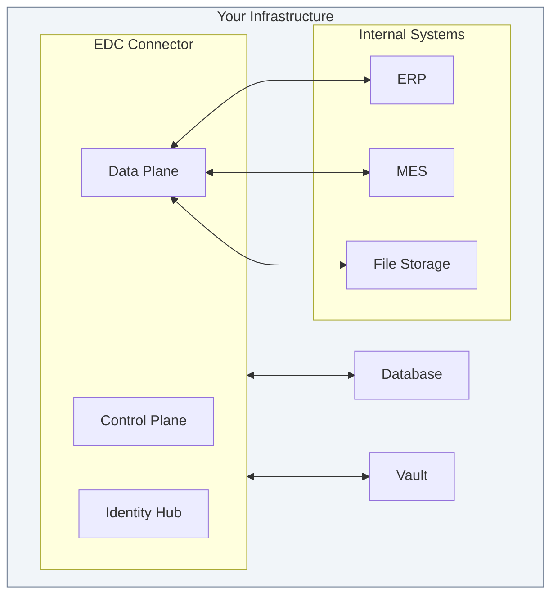
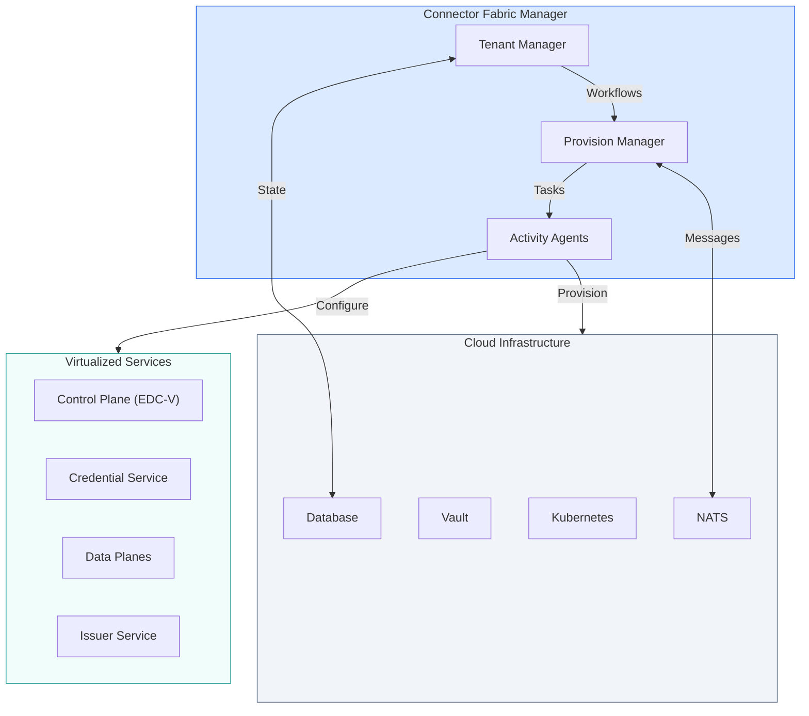
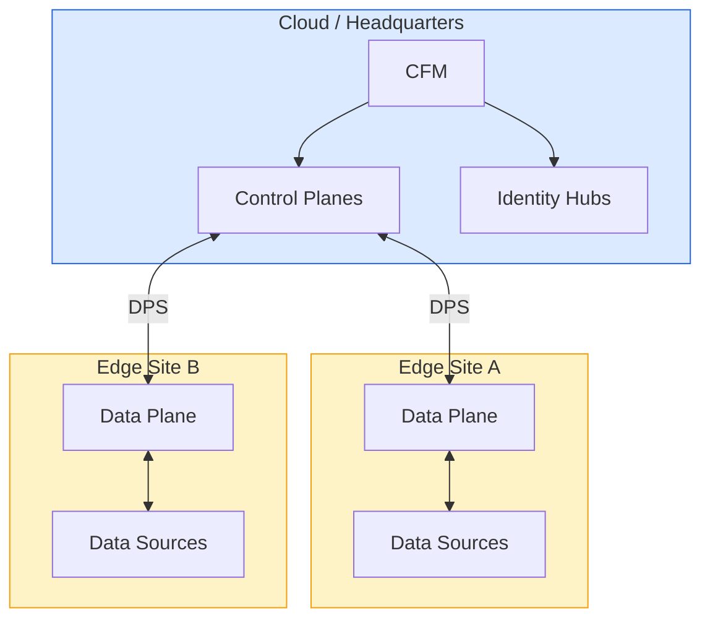
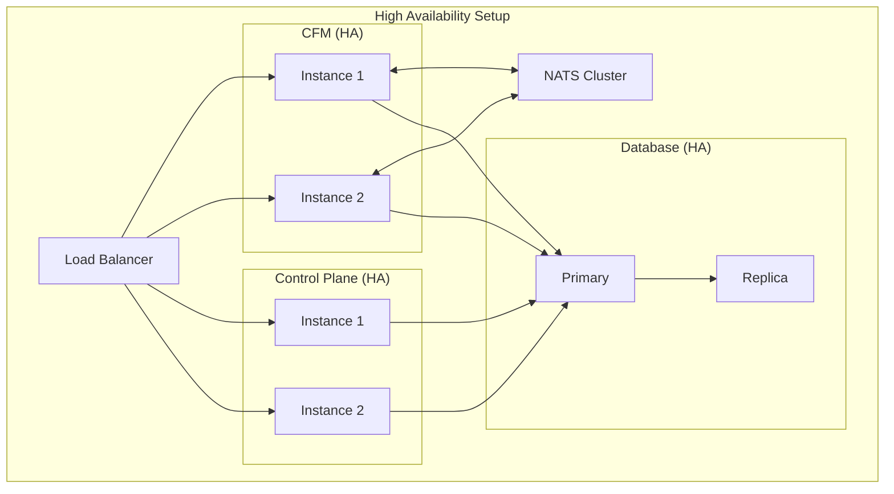

# Deployment Models

The dataspace architecture is infrastructure-agnostic. Whether you run in the cloud, on-premises, or at the edge, the components adapt to your requirements. This page covers deployment options, migration strategies, and governance authority implementation.

---

## Deployment Flexibility

| Benefit | Description |
|---------|-------------|
| **No vendor lock-in** | Run on any infrastructure provider |
| **Data sovereignty** | Keep data where regulations require |
| **Performance** | Deploy close to data sources |
| **Hybrid** | Mix deployment models as needed |

---

## Choosing Your Deployment Model

### Decision Framework

| If you... | Consider... |
|-----------|-------------|
| Need full control over infrastructure | **Single-tenant** deployment |
| Are offering Dataspace-as-a-Service | **Multi-tenant (CFM + EDC-V)** |
| Have data at remote sites | **Edge** Data Planes |
| Have regulatory requirements | **Jurisdiction-specific** cells |
| Are starting out | **Single-tenant**, migrate later |

---

## Single-Tenant Deployment

Traditional model where each organization deploys its own connector stack.

### Architecture



### When to Use

| Scenario | Fit |
|----------|-----|
| Self-hosted enterprise | ✓ Excellent |
| Development/testing | ✓ Excellent |
| Edge deployment | ✓ Good |
| Regulatory requirements | ✓ Good (dedicated infrastructure) |
| Service provider with many tenants | ✗ Poor (doesn't scale) |

### Deployment Variants

| Variant | Description | Best For |
|---------|-------------|----------|
| **Embedded** | All components in one process | Development, edge |
| **Separate** | Each component as separate service | Production |
| **Clustered** | Multiple instances, load balanced | High availability |

---

## Multi-Tenant Deployment (CFM + EDC-V)

Modern model where CFM orchestrates shared infrastructure serving multiple participants.

### Architecture



### When to Use

| Scenario | Fit |
|----------|-----|
| Cloud service provider (DSaaS) | ✓ Excellent |
| Large enterprise (multi-BU) | ✓ Excellent |
| Consortium/industry dataspace | ✓ Excellent |
| Managed service offering | ✓ Good |
| Single small deployment | ✗ Overkill |

### Multi-Tenant Benefits

| Benefit | Description |
|---------|-------------|
| **Efficiency** | Share infrastructure costs across tenants |
| **Operations** | Centralized updates and monitoring |
| **Scalability** | Add tenants without new infrastructure |
| **Isolation** | Strict boundaries between VPAs |
| **Migration** | Move VPAs between cells easily |

---

## Edge Deployment

Data planes deployed close to data sources, with control planes centralized.

### Architecture



### When to Use

| Scenario | Fit |
|----------|-----|
| Industrial IoT | ✓ Excellent |
| Manufacturing plants | ✓ Excellent |
| Low-latency requirements | ✓ Excellent |
| Remote locations | ✓ Good |
| Bandwidth optimization | ✓ Good |

### Edge Cell Characteristics

| Property | Edge Cell | Cloud Cell |
|----------|-----------|------------|
| **Size** | Minimal (single node K3s) | Standard Kubernetes |
| **Components** | Data Plane only | Full stack |
| **Connectivity** | May be intermittent | Always connected |
| **Scaling** | Limited | Dynamic |

---

## Hybrid Deployment

Combine multiple models based on requirements.

### Example: Industrial Enterprise

```
┌─────────────────────────────────────────────────────────────────────────┐
│                         Hybrid Deployment                                │
├─────────────────────────────────────────────────────────────────────────┤
│                                                                          │
│   Cloud (Azure EU-West)                                                  │
│   ┌─────────────────────────────────────────────────────────────────┐   │
│   │  CFM + Control Plane Cell + Identity Hub Cell                    │   │
│   │  • Central management                                            │   │
│   │  • Business logic                                                │   │
│   │  • Trust decisions                                               │   │
│   └─────────────────────────────────────────────────────────────────┘   │
│                              │                                           │
│                         DPS Signaling                                    │
│              ┌───────────────┼───────────────┐                          │
│              │               │               │                          │
│              ▼               ▼               ▼                          │
│   ┌──────────────┐  ┌──────────────┐  ┌──────────────┐                  │
│   │ Edge Cell:   │  │ Edge Cell:   │  │ Edge Cell:   │                  │
│   │ Factory DE   │  │ Factory PL   │  │ Factory US   │                  │
│   │              │  │              │  │              │                  │
│   │ DP VPAs for  │  │ DP VPAs for  │  │ DP VPAs for  │                  │
│   │ local data   │  │ local data   │  │ local data   │                  │
│   └──────────────┘  └──────────────┘  └──────────────┘                  │
│                                                                          │
└─────────────────────────────────────────────────────────────────────────┘
```

---

## Migration Path

Moving from single-tenant to multi-tenant, or upgrading existing deployments.

### Assessment: Where Are You Today?

| Current State | Migration Complexity |
|---------------|---------------------|
| Single EDC connector, dev/test | **Low** — Deploy CFM, provision VPA |
| Multiple connectors, production | **Medium** — Consolidate to shared runtime |
| Custom extensions | **Variable** — Assess compatibility |
| Many tenants, separate deployments | **Medium** — Centralize management |

### Migration Strategies

#### Strategy A: Side-by-Side

Deploy new stack alongside existing, migrate gradually:

```
Phase 1: Deploy CFM + EDC-V
┌─────────────────┐    ┌─────────────────┐
│  Existing EDC   │    │  New CFM Stack  │
│  (Production)   │    │  (Staging)      │
└─────────────────┘    └─────────────────┘

Phase 2: Migrate Tenants
┌─────────────────┐    ┌─────────────────┐
│  Existing EDC   │ →  │  CFM Stack      │
│  (Fewer tenants)│    │  (More tenants) │
└─────────────────┘    └─────────────────┘

Phase 3: Complete Migration
                       ┌─────────────────┐
                       │  CFM Stack      │
                       │  (All tenants)  │
                       └─────────────────┘
```

**Advantages:**
- No downtime during migration
- Gradual risk reduction
- Easy rollback

#### Strategy B: In-Place Evolution

Deploy CFM to manage existing infrastructure:

```
Phase 1: Deploy CFM
┌─────────────────┐    ┌─────────────────┐
│  Existing EDC   │ ← │  CFM (manages)  │
│  (Unchanged)    │    │                 │
└─────────────────┘    └─────────────────┘

Phase 2: Convert to VPA
┌─────────────────┐    ┌─────────────────┐
│  EDC-V Runtime  │ ← │  CFM            │
│  (VPA-based)    │    │  (Full control) │
└─────────────────┘    └─────────────────┘
```

**Advantages:**
- Reuse existing infrastructure
- Lower initial cost
- Gradual modernization

### Key Migration Considerations

| Consideration | Guidance |
|--------------|----------|
| **Identity preservation** | DIDs must remain valid—don't change identities |
| **Contract continuity** | Existing agreements must be honored |
| **Integration updates** | API paths change for multi-tenant |
| **Trust preservation** | Credentials and policies must transfer |

### What Changes for Developers/Operators

| Aspect | Traditional | CFM-Managed |
|--------|-------------|-------------|
| Deploying a connector | Deploy full stack | Provision VPA via CFM API |
| Scaling | Add container replicas | Add cells, CFM handles VPA placement |
| Tenant isolation | Separate deployments | Configuration contexts |
| Monitoring | Per-connector metrics | Per-VPA metrics within shared runtime |
| Trust management | Per-connector credentials | Per-VPA credentials in shared Vault |

### Migration Steps

1. **Assessment**
   - Inventory existing deployments
   - Identify customizations and extensions
   - Map current identities and credentials

2. **Planning**
   - Choose migration strategy (side-by-side or in-place)
   - Define cell structure
   - Plan credential migration

3. **CFM Deployment**
   - Deploy CFM infrastructure
   - Configure cells
   - Set up monitoring

4. **VPA Provisioning**
   - Create participant profiles
   - Provision VPAs
   - Migrate credentials to Vault

5. **Traffic Migration**
   - Update DNS/routing
   - Migrate traffic gradually
   - Monitor for issues

6. **Decommission Legacy**
   - Verify all traffic on new stack
   - Remove old deployments
   - Archive old configurations

---

## Governance Authority (DSGA) Implementation

For organizations operating a dataspace and providing governance authority functions.

### What is a DSGA?

A **Dataspace Governance Authority** sets rules, policies, and accepted trust anchors for a dataspace. It may be:

- The DSaaS provider operating the infrastructure
- A separate governance entity
- A consortium or industry body

### DSGA Functions

| Function | Description |
|----------|-------------|
| **Membership management** | Who can join the dataspace |
| **Trust anchor registry** | Which issuers are trusted |
| **Credential issuance** | Issue membership and role credentials |
| **Policy definition** | Standard policies for the dataspace |
| **Dispute resolution** | Handle conflicts between participants |

### Implementing DSGA with CFM

```
┌─────────────────────────────────────────────────────────────────────────┐
│                    DSGA Implementation                                   │
├─────────────────────────────────────────────────────────────────────────┤
│                                                                          │
│   DSGA Functions                    CFM Implementation                   │
│   ┌────────────────────┐           ┌────────────────────┐               │
│   │ Membership         │     →     │ Tenant Manager     │               │
│   │ Management         │           │ (onboarding flow)  │               │
│   └────────────────────┘           └────────────────────┘               │
│                                                                          │
│   ┌────────────────────┐           ┌────────────────────┐               │
│   │ Trust Anchor       │     →     │ Trust Registry     │               │
│   │ Registry           │           │ (external service) │               │
│   └────────────────────┘           └────────────────────┘               │
│                                                                          │
│   ┌────────────────────┐           ┌────────────────────┐               │
│   │ Credential         │     →     │ Issuer Service VPA │               │
│   │ Issuance           │           │ (issue membership) │               │
│   └────────────────────┘           └────────────────────┘               │
│                                                                          │
│   ┌────────────────────┐           ┌────────────────────┐               │
│   │ Policy             │     →     │ Control Plane VPAs │               │
│   │ Enforcement        │           │ (per participant)  │               │
│   └────────────────────┘           └────────────────────┘               │
│                                                                          │
└─────────────────────────────────────────────────────────────────────────┘
```

### DSGA Architecture

```
┌─────────────────────────────────────────────────────────────────────────┐
│                    DSGA-Operated Dataspace                               │
├─────────────────────────────────────────────────────────────────────────┤
│                                                                          │
│   Governance Layer (DSGA)                                                │
│   ┌─────────────────────────────────────────────────────────────────┐   │
│   │  Onboarding Portal    Trust Registry    Credential Issuer        │   │
│   │  (membership app)     (issuer list)     (Issuer Service VPA)    │   │
│   └─────────────────────────────────────────────────────────────────┘   │
│                              │                                           │
│                              ▼                                           │
│   Management Layer (CFM)                                                 │
│   ┌─────────────────────────────────────────────────────────────────┐   │
│   │  Tenant Manager       Provision Manager    Activity Agents       │   │
│   │  (participant DB)     (workflows)          (provisioning)        │   │
│   └─────────────────────────────────────────────────────────────────┘   │
│                              │                                           │
│                              ▼                                           │
│   Participant Layer                                                      │
│   ┌──────────────┐  ┌──────────────┐  ┌──────────────┐                  │
│   │ Participant A│  │ Participant B│  │ Participant C│  ...             │
│   │ (VPA Set)    │  │ (VPA Set)    │  │ (VPA Set)    │                  │
│   └──────────────┘  └──────────────┘  └──────────────┘                  │
│                                                                          │
└─────────────────────────────────────────────────────────────────────────┘
```

### Adding New Trust Frameworks (DTFs)

To support a new Dataspace Trust Framework:

1. **Define credential schemas**
   - What credentials does this DTF require?
   - What claims must they contain?

2. **Register trust anchors**
   - Who can issue these credentials?
   - Add issuers to trust registry

3. **Configure policy evaluation**
   - How do claims map to access decisions?
   - Create policy definitions

4. **Provision dataspace profiles**
   - Per-participant DTF configuration
   - Credential requirements

### Example: Adding Catena-X Support

```json
{
  "dtfId": "catena-x-v2",
  "name": "Catena-X Trust Framework v2",
  "credentialSchemas": [
    {
      "type": "MembershipCredential",
      "requiredClaims": ["memberOf", "membershipLevel", "validUntil"]
    },
    {
      "type": "BPNCertificate",
      "requiredClaims": ["bpn", "legalName", "country"]
    }
  ],
  "trustedIssuers": [
    "did:web:catena-x.net:issuer",
    "did:web:cofinity-x.com:issuer"
  ],
  "policyTemplates": [
    {
      "id": "catena-x-member-only",
      "constraint": {
        "leftOperand": "MembershipCredential",
        "operator": "eq",
        "rightOperand": "active"
      }
    }
  ]
}
```

---

## Component Placement

### Recommendations

| Component | Placement | Reason |
|-----------|-----------|--------|
| **CFM** | Central cloud (HA) | Management control |
| **Control Plane** | Cloud or central DC | Business logic, HA |
| **Identity Hub** | Co-located with CP | Tight integration |
| **Data Plane** | Close to data sources | Minimize latency |

### High Availability



---

## Security Considerations

### Network Security

| Requirement | Implementation |
|-------------|----------------|
| **TLS everywhere** | All endpoints use HTTPS/TLS 1.3 |
| **Network segmentation** | Separate management and data networks |
| **Firewall rules** | Restrict to required ports |
| **DDoS protection** | Edge protection for public endpoints |

### Access Control

| Component | Access Control |
|-----------|----------------|
| CFM API | OAuth2 with role claims |
| Management API | OAuth2 tokens with role claims |
| DSP endpoints | Mutual TLS or signed requests |
| Data Plane | Access tokens tied to agreements |

### CFM Roles

| Role | Capabilities |
|------|--------------|
| **Admin** | Full access to all APIs and data |
| **Provisioner** | Create/manage tenants and VPAs |
| **Participant** | Manage own VPA resources only |

---

## Monitoring and Observability

### Key Metrics

| Type | Examples |
|------|----------|
| **Business** | Contracts negotiated, transfers completed, tenants active |
| **Technical** | Request latency, error rates, queue depth |
| **Infrastructure** | CPU, memory, network |

### Recommended Stack

- **Metrics:** Prometheus + Grafana
- **Logging:** ELK Stack or cloud-native logging
- **Tracing:** Jaeger or cloud-native tracing
- **Alerting:** Based on state machine failures, error rates

---

## What's Next

- **[Understanding the Stack](/docs/architecture/understanding-the-stack)** — Traditional vs. Modern architecture
- **[Core Concepts](/docs/architecture/core-concepts)** — VPAs, Cells, Service Virtualization
- **[Components Deep Dive](/docs/architecture/components)** — CFM and component details
- **[Overview](/docs/architecture/overview)** — Architecture fundamentals
