# Deployment Topologies

The dataspace architecture is infrastructure-agnostic. Whether you run in the cloud, on-premises, or at the edge, the components adapt to your requirements. This flexibility is essential for data sovereignty and regulatory compliance.

---

## Deployment Flexibility

One of the key benefits of the EDC-based architecture:

| Benefit | Description |
|---------|-------------|
| **No vendor lock-in** | Run on any infrastructure provider |
| **Data sovereignty** | Keep data where regulations require |
| **Performance** | Deploy close to data sources |
| **Hybrid** | Mix deployment models as needed |

---

## Common Deployment Patterns

### Cloud-Native Deployment

Run connectors as containerized services in Kubernetes:

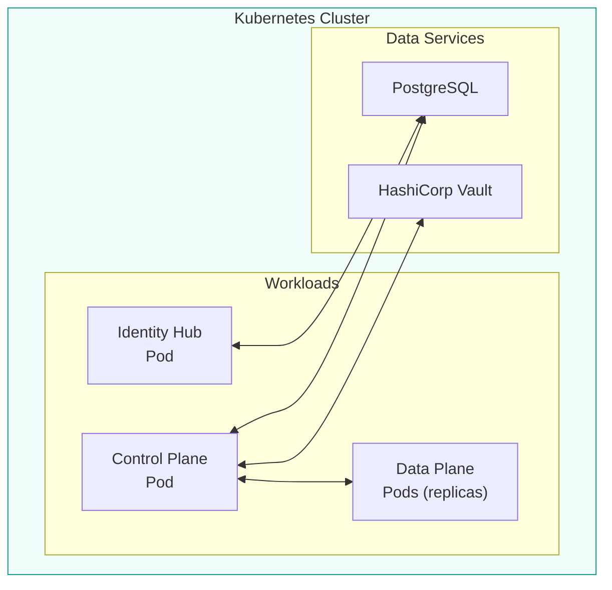

**Characteristics:**
- Horizontal scaling for data plane
- Managed database services
- Kubernetes-native observability
- GitOps deployment patterns

**Best for:**
- Scalable multi-tenant deployments
- Dynamic workloads
- Organizations with Kubernetes expertise

### On-Premises Deployment

Run connectors within corporate infrastructure:

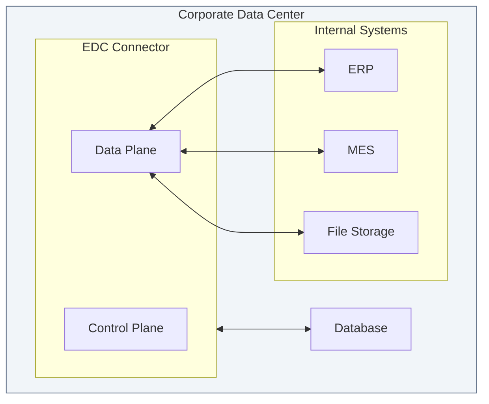

**Characteristics:**
- Data never leaves the corporate network
- Integration with existing systems
- Use existing security infrastructure
- Full control over deployment

**Best for:**
- Regulated industries (finance, healthcare)
- Sensitive data that cannot leave premises
- Organizations with existing data center investments

### Edge Deployment

Run data planes close to data sources:

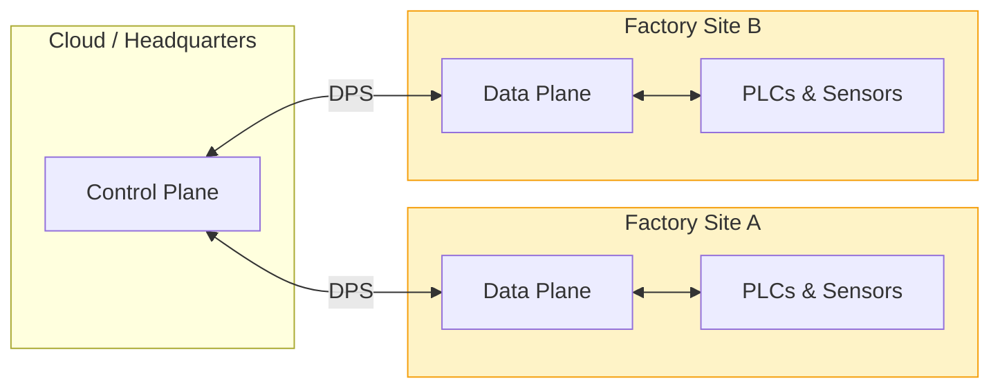

**Characteristics:**
- Centralized control, distributed data access
- Minimize data movement over WAN
- Low-latency access to operational data
- Works with limited connectivity

**Best for:**
- Industrial IoT scenarios
- Manufacturing plants
- Remote locations with limited bandwidth
- Real-time data requirements

### Hybrid Multi-Cloud

Span multiple cloud providers and on-premises:

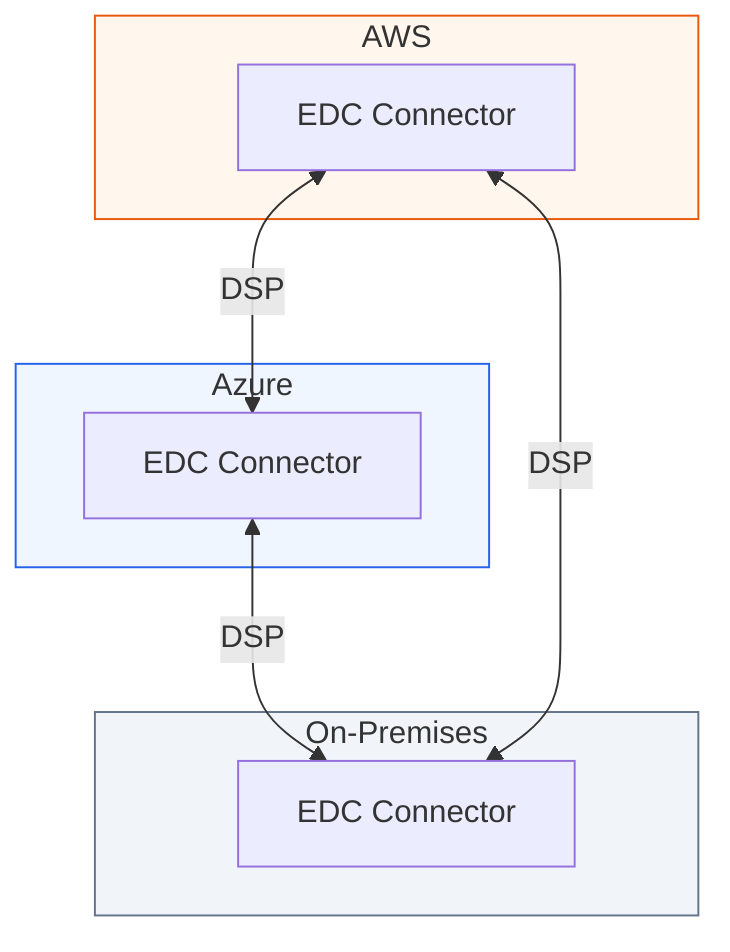

**Characteristics:**
- Interoperable across providers
- Avoid single-cloud dependency
- Meet data residency requirements
- Disaster recovery across regions

**Best for:**
- Multi-cloud strategies
- Organizations with global presence
- Regulatory requirements for data location
- Business continuity requirements

---

## Management Domains

A **management domain** is a *realm of control over a set of EDC components*. Management domains enable operational responsibility to be delegated throughout an organization.

### Type 1: Single Management Domain

A single management domain deploys EDC components under one unified operations setup:

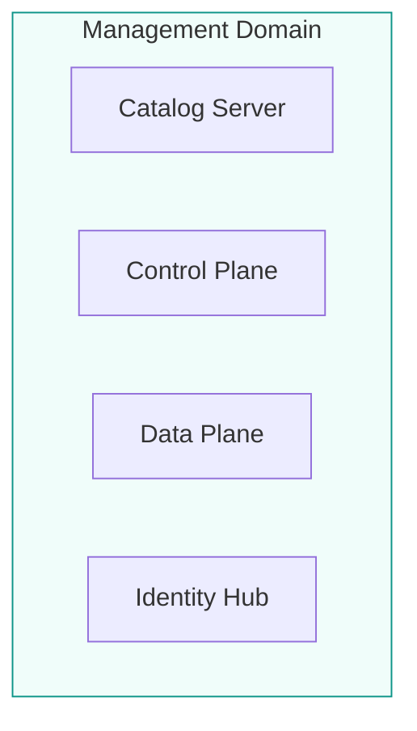

**Variants:**
- **Collocated** — All components in a single process (development/edge)
- **Clustered** — Separate ReplicaSets in one Kubernetes cluster (production)

### Type 2: Distributed Management Domains

For organizations with independent subdivisions, components are deployed across multiple management domains.

#### Type 2A: Separate EDC Stacks

Each division deploys a complete EDC stack. A root catalog fronts all divisions:

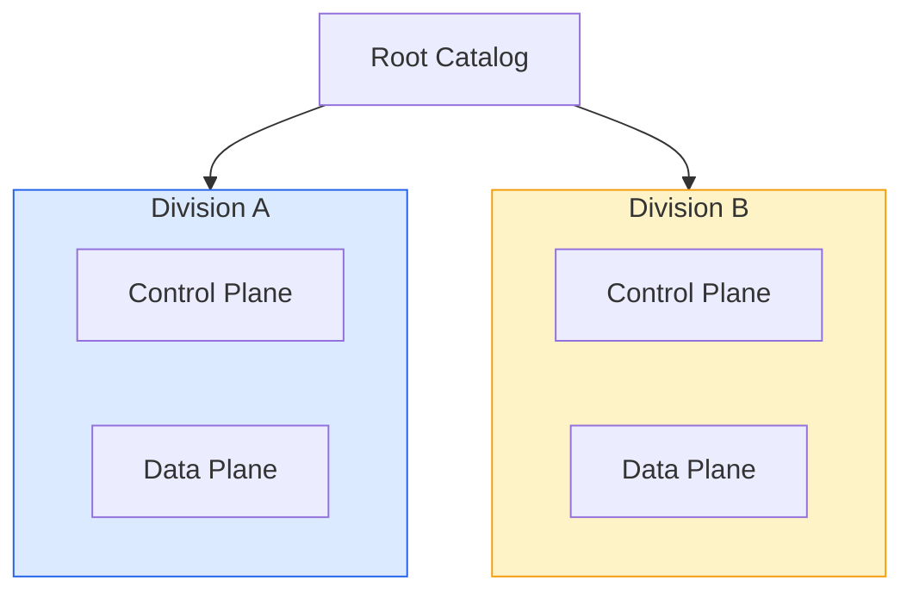

#### Type 2B: Central Catalog, Distributed Control/Data Planes

A central catalog server fronts distributed control/data plane runtimes:

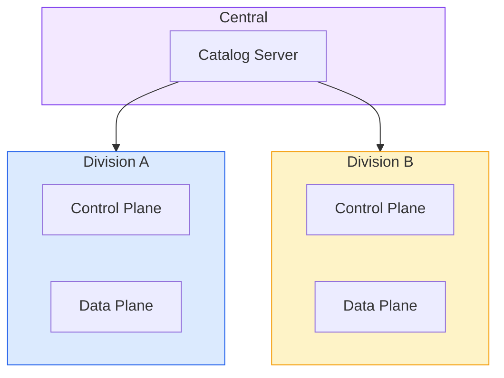

#### Type 2C: Central Catalog/Control Plane, Distributed Data Planes

A centralized catalog/control plane with distributed data planes:

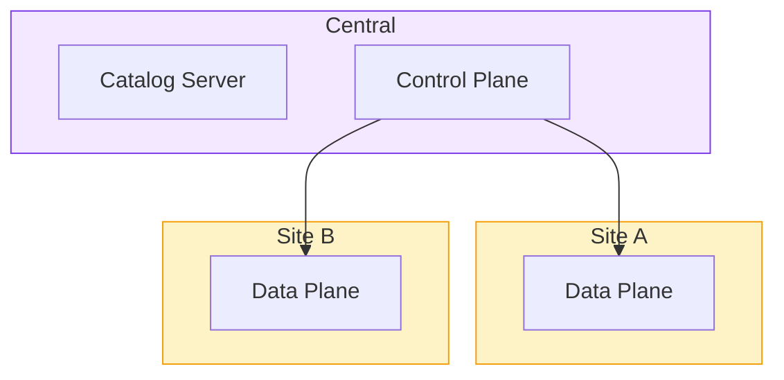

### Linked Catalogs

Management domains are configured using **linked catalogs**. A root catalog contains sub-catalog entries that reference other catalog endpoints:

```json
{
  "@type": "dcat:Catalog",
  "dcat:catalog": {
    "@type": "dcat:Catalog",
    "dcat:distribution": {
      "dcat:accessService": {
        "dcat:endpointURL": "https://division-a.foo.com/catalog"
      }
    }
  }
}
```

Sub-catalogs are created by adding **CatalogAsset** entries that point to other catalog endpoints, combined with contract definitions that control access.

---

## Multi-Tenant Deployment with CFM

For cloud service providers hosting multiple organizations, the **Connector Fabric Manager (CFM)** orchestrates efficient multi-tenant deployments using the **Virtual Connector (EDC-V)** architecture.

### System Architecture

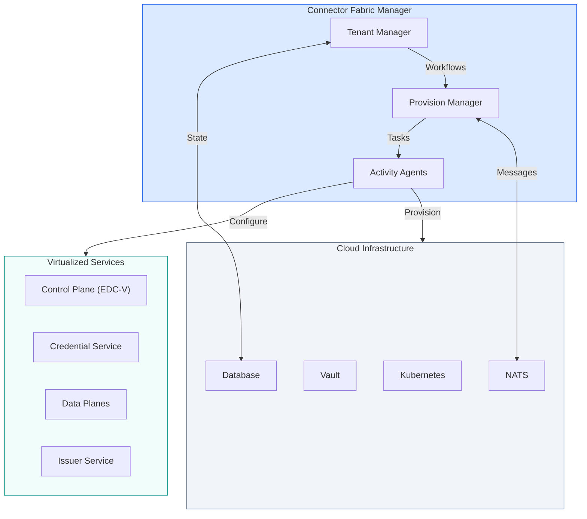

The CFM provides:

| Capability | Description |
|------------|-------------|
| **Tenant lifecycle** | Create, update, delete participant contexts |
| **Resource orchestration** | Provision control planes, data planes, identity hubs |
| **DNS management** | Configure routing and endpoints |
| **Credential setup** | Initialize DID documents and credentials |
| **Infrastructure integration** | Coordinate with Kubernetes, vaults, databases |

### Service Virtualization Model

The CFM implements **service virtualization**—a single deployment serves multiple participants through **configuration-based isolation**, not process isolation:

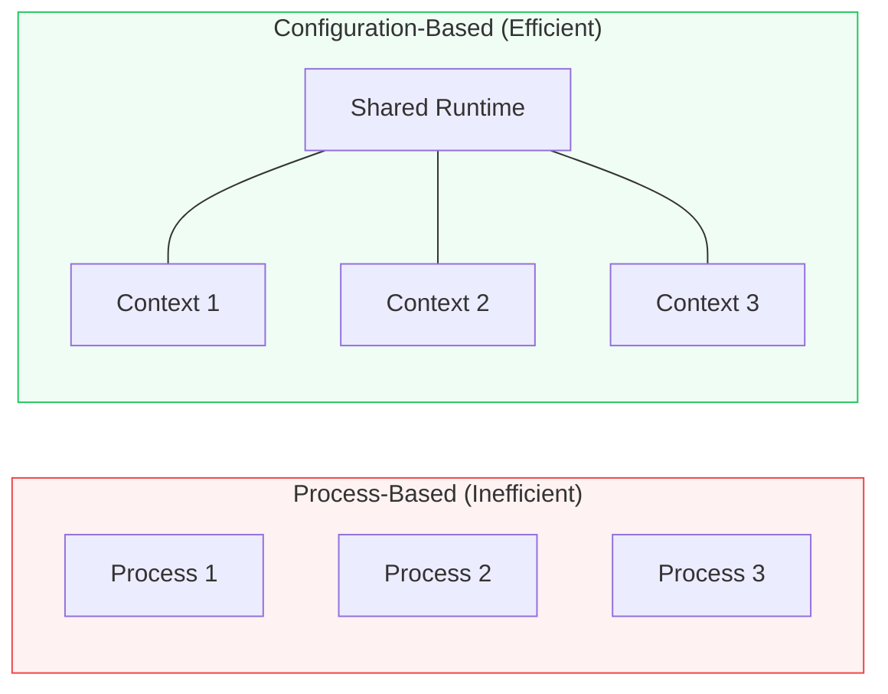

**Why configuration-based:**

| Aspect | Process-Based | Configuration-Based |
|--------|---------------|---------------------|
| **Resource usage** | High (separate processes per tenant) | Low (shared runtime) |
| **Scaling** | Linear with tenants | Sub-linear |
| **Migration** | Complex (move processes) | Simple (move metadata) |
| **Isolation** | Strong (OS-level) | Strong (context-level) |

### Virtualization Model Concepts

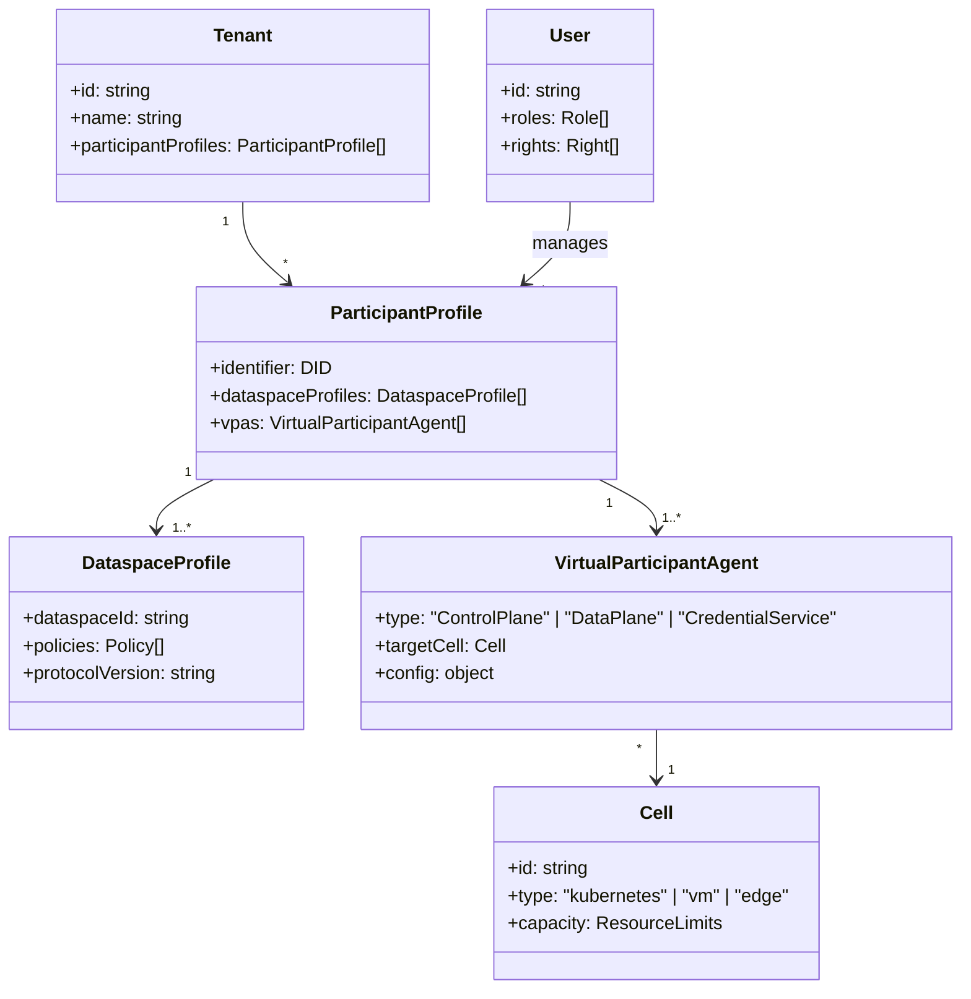

| Concept | Description |
|---------|-------------|
| **Tenant** | Organization that participates in dataspaces |
| **Participant Profile** | Links an identifier (DID) to dataspace memberships |
| **Dataspace Profile** | Configuration for a specific dataspace |
| **Virtual Participant Agent (VPA)** | Unit of deployment—control plane, data plane, or credential service |
| **Cell** | Homogenous deployment zone (Kubernetes cluster, VM pool) |
| **User** | Administrator who manages VPAs via RBAC |

### Virtual Participant Agents (VPAs)

A VPA is the unit of administrative control and deployment. When a participant is provisioned, multiple VPA types are created:

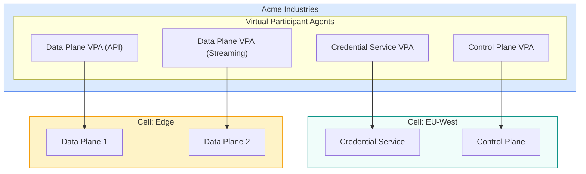

**VPA characteristics:**

- **Type-specific:** Control Plane VPA, Data Plane VPA, Credential Service VPA
- **Cell-targeted:** Each VPA runs in a specific cell
- **Independently scalable:** Cells manage their own scaling (e.g., via Keda)
- **Migratable:** Move VPA metadata to migrate between cells

### Identity Scenarios

A dataspace constraint: **A participant has one and only one identifier.**

| Scenario | Result |
|----------|--------|
| **One DID per dataspace** | Multiple participant profiles (one per dataspace) |
| **One DID across dataspaces** | Single participant profile for all dataspaces |
| **Multiple DIDs** | Multiple participants (or mapped to single identity) |

### CFM Subsystems

The CFM is built as a reliable message-based system:

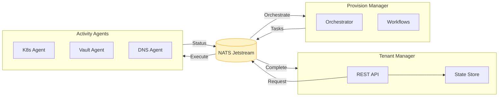

| Subsystem | Responsibility |
|-----------|----------------|
| **Tenant Manager** | REST API, state management, initiates workflows |
| **Provision Manager** | Executes stateful orchestration workflows |
| **Activity Agents** | Execute tasks, isolated from provisioner |
| **NATS Jetstream** | Reliable messaging with persistence |

**Architectural benefits:**

- **Temporal decoupling:** Components operate independently
- **Spatial decoupling:** Agents can run in different locations
- **Reliability:** NATS persistence ensures no message loss
- **Security:** Agents isolate infrastructure secrets from provisioner

---

## EDC-V Runtime Architecture

The Virtual Connector provides the runtime for multi-tenant control planes:

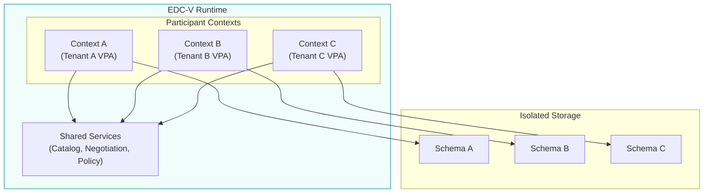

### Context Isolation

Each VPA operates in an isolated context with:

| Isolation | Implementation |
|-----------|----------------|
| **API paths** | `/participants/{participantId}/...` |
| **Data storage** | Tenant-specific schemas or row-level security |
| **Credentials** | Separate credential stores |
| **Data planes** | Dedicated per tenant |

### Context Migration

Moving a VPA between cells requires only moving metadata:

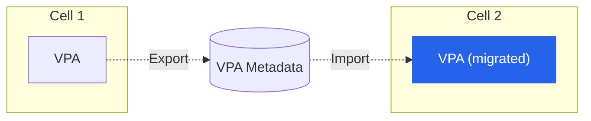

---

## Component Placement

### Recommendations by Component

| Component | Recommended Placement |
|-----------|----------------------|
| **CFM** | Central cloud (HA) |
| **Control Plane** | Cloud or central data center (HA) |
| **Identity Hub** | Co-located with Control Plane |
| **Data Plane** | Close to data sources |
| **Database** | Managed service or HA cluster |

### High Availability Considerations

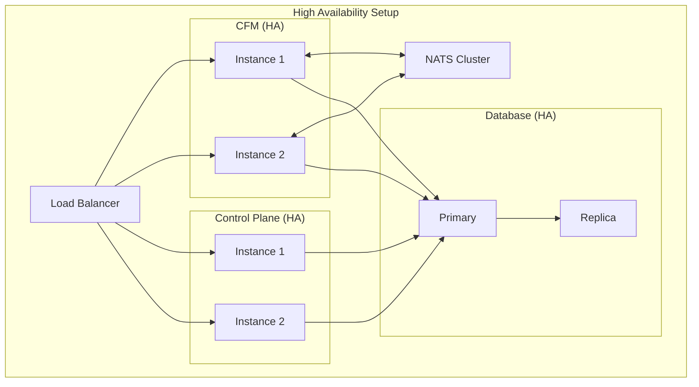

---

## Infrastructure Requirements

### Control Plane

| Resource | Specification |
|----------|---------------|
| CPU | 2-4 vCPUs |
| Memory | 4-8 GB RAM |
| Storage | Database connection |
| Network | HTTPS endpoints |

### Identity Hub

| Resource | Specification |
|----------|---------------|
| CPU | 1-2 vCPUs |
| Memory | 2-4 GB RAM |
| Storage | Credential store |
| Network | DID resolution endpoints |

### Data Plane

| Resource | Specification |
|----------|---------------|
| CPU | Scales with throughput |
| Memory | Scales with concurrency |
| Storage | Temp buffer space |
| Network | High bandwidth |

### Connector Fabric Manager

| Resource | Specification |
|----------|---------------|
| CPU | 2-4 vCPUs |
| Memory | 4-8 GB RAM |
| Storage | PostgreSQL |
| Messaging | NATS Jetstream |
| Network | Cloud API access |

---

## Security Considerations

### Network Security

| Requirement | Implementation |
|-------------|----------------|
| **TLS everywhere** | All endpoints use HTTPS/TLS 1.3 |
| **Network segmentation** | Separate management and data networks |
| **Firewall rules** | Restrict to required ports |
| **DDoS protection** | Edge protection for public endpoints |

### Access Control

| Component | Access Control |
|-----------|----------------|
| CFM API | OAuth2 with role claims (admin, provisioner, participant) |
| Management API | OAuth2 tokens with role claims |
| DSP endpoints | Mutual TLS or signed requests |
| Data Plane | Access tokens tied to agreements |

### CFM Roles

| Role | Capabilities |
|------|--------------|
| **Admin** | Full access to all APIs and data |
| **Provisioner** | Create/manage tenants and VPAs |
| **Participant** | Manage own VPA resources only |

### Secrets Management

| Secret Type | Recommendation |
|-------------|----------------|
| Private keys | HSM or secure vault |
| Database credentials | Vault with rotation |
| API tokens | Short-lived, scoped |

---

## Monitoring and Observability

### Metrics

| Metric Type | Examples |
|-------------|----------|
| Business | Contracts negotiated, transfers completed, tenants active |
| Technical | Request latency, error rates, queue depth |
| Infrastructure | CPU, memory, network |

### Logging

| Log Type | Purpose |
|----------|---------|
| Audit logs | Compliance, security review |
| Application logs | Debugging, troubleshooting |
| Access logs | Security monitoring |
| Provisioning logs | Workflow tracking |

### Recommended Stack

- **Metrics:** Prometheus + Grafana
- **Logging:** ELK Stack or cloud-native logging
- **Tracing:** Jaeger or cloud-native tracing
- **Alerting:** Based on state machine failures, error rates, provisioning failures

---

## Migration Considerations

### From Development to Production

1. **Externalize data plane** — Move from embedded to separate service
2. **Add high availability** — Multiple instances, load balancing
3. **Production database** — Managed service with backups
4. **Security hardening** — TLS, secrets management, network isolation

### From Single-Tenant to Multi-Tenant

1. **Deploy CFM** — Set up Tenant Manager, Provision Manager, Agents
2. **Deploy EDC-V** — Replace single connector with virtual connector
3. **Configure cells** — Define deployment zones
4. **Migrate tenants** — Create VPAs for existing participants
5. **Update integrations** — Use tenant-specific API paths
6. **Verify isolation** — Test VPA boundaries

---

## What's Next

- **[Components Overview](/docs/architecture/components)** — Understand each component including CFM
- **[Control Plane](/docs/architecture/control-plane)** — Business logic deployment
- **[Data Plane](/docs/architecture/data-plane)** — Data transfer deployment
- **[Overview](/docs/architecture/overview)** — Architecture fundamentals
