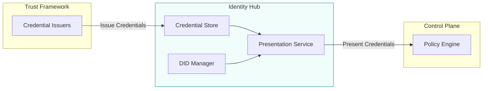
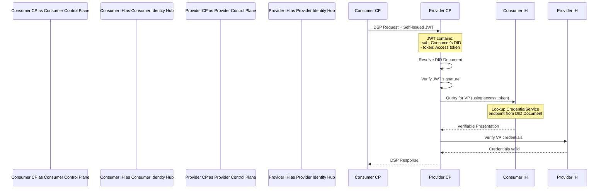
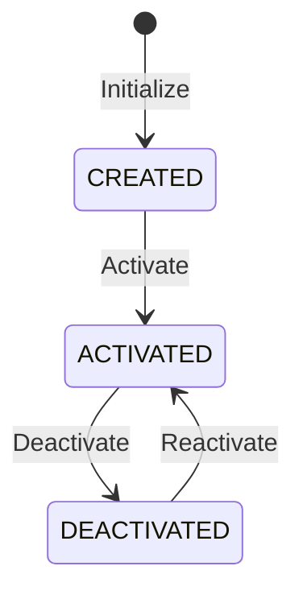
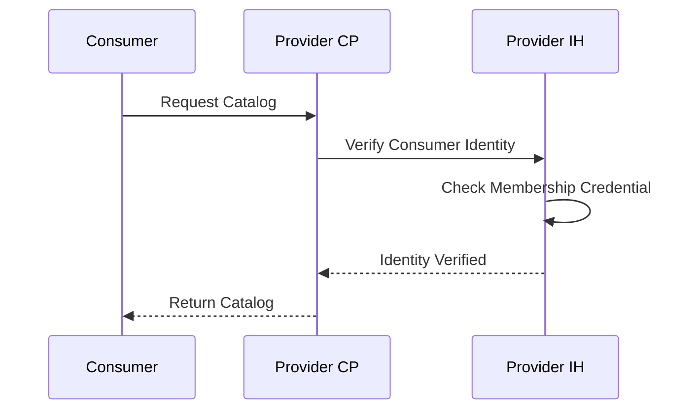
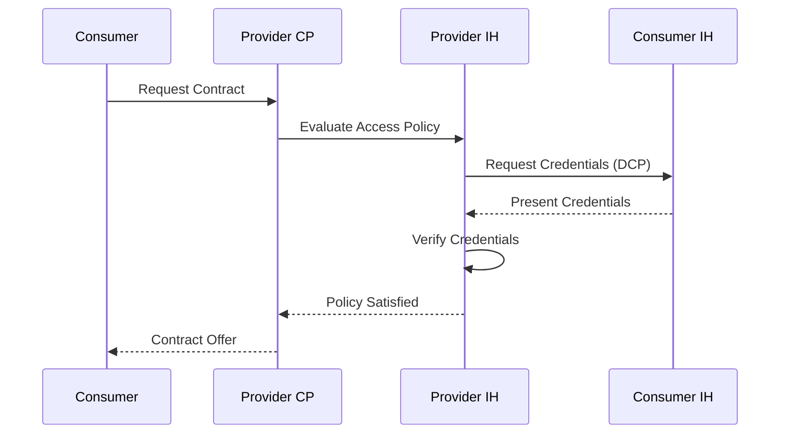

# Identity Hub

The Identity Hub (IH) manages organization identity resources for a dataspace participant. It is designed for **machine-to-machine interactions** and does not manage personal verifiable credentials.

Identity Hub implements the Decentralized Claims Protocol (DCP) and is based on key decentralized identity standards:
- [W3C DIDs](https://www.w3.org/TR/did-core/)
- [W3C did:web Method](https://w3c-ccg.github.io/did-method-web/)
- [W3C Verifiable Credentials Data Model](https://www.w3.org/TR/vc-data-model/)

:::note OID4VC vs DCP
Identity Hub does **not** support OpenID for Verifiable Credentials (OID4VC). OID4VC mandates human (end-user) interactions, while Identity Hub is designed for machine-to-machine flows where humans are not in the loop.
:::

---

## Role in the Architecture

The Identity Hub sits between the trust framework and the control plane:



**Key responsibilities:**

- Store verifiable credentials issued by trusted authorities
- Manage Decentralized Identifiers (DIDs) and key pairs
- Create verifiable presentations when proving attributes
- Verify credentials presented by other parties

---

## Key Concepts

### Decentralized Identifiers (DIDs)

DIDs are globally unique identifiers controlled by the identity owner:

```
did:web:example.com:participant:acme-corp
```

Properties of DIDs:
- **Self-sovereign** — Controlled by the owner, not a central authority
- **Resolvable** — Can be resolved to a DID Document containing public keys
- **Cryptographically verifiable** — Enable proof of identity control
- **Method-agnostic** — Support multiple DID methods (did:web, did:key)

### Verifiable Credentials

Digital credentials that prove attributes about the holder:

```json
{
  "@context": ["https://www.w3.org/2018/credentials/v1"],
  "type": ["VerifiableCredential", "MembershipCredential"],
  "issuer": "did:web:catena-x.net:issuer",
  "credentialSubject": {
    "id": "did:web:acme-corp.com",
    "memberOf": "Catena-X",
    "memberSince": "2024-01-15"
  },
  "proof": { ... }
}
```

Properties:
- **Issued by trusted authorities** — Credential issuers defined by the trust framework
- **Cryptographically signed** — Cannot be forged or tampered with
- **Machine-verifiable** — Automated verification without contacting issuer
- **Revocable** — Issuers can revoke credentials when needed

### Verifiable Presentations

When proving attributes to another party:

1. Select relevant credentials from the credential store
2. Create a presentation proving you hold them
3. Include proof that you control your DID
4. Share only what's needed (selective disclosure)

---

## The Presentation Flow

Understanding how credentials are presented is key to understanding Identity Hub. Here's the complete flow:



### Why This Design?

**Why not include credentials in the request header?**

Verifiable Presentations often exceed HTTP header size limits. More importantly, the DCP model enables **ongoing credential checks**. For example, a policy monitor can query the consumer's Identity Hub periodically during a long-running data stream—without the consumer initiating each request.

### Self-Issued Tokens

DCP uses **self-issued tokens** instead of tokens from a central identity provider:

| Aspect | Centralized Identity | DCP (Decentralized) |
|--------|---------------------|---------------------|
| Token issuer | Central IdP | Requesting party (self-signed) |
| Verification | Contact IdP | Resolve DID, check signature |
| Privacy | IdP knows all communications | No third-party visibility |
| Availability | Single point of failure | No central dependency |

---

## Participant Context

A **participant context** is the unit of control for resources in Identity Hub. It is tied to a dataspace participant identity.



| State | Resources | Public Access |
|-------|-----------|---------------|
| **CREATED** | Can be added/updated | No |
| **ACTIVATED** | Operational | Yes |
| **DEACTIVATED** | Can be added/updated | No |

**Key properties:**
- Acts as both **scope** and **security boundary**
- Access tokens are scoped to a specific context
- Resource lifecycle is bound to the context (delete cascades)

Most organizations have a single participant context (one identity). Organizations using different identities in multiple dataspaces will have one context per identity.

---

## Identity Hub APIs

The Identity Hub exposes several API surfaces:

### Identity API

For managing the participant's own identity:

| Operation | Purpose |
|-----------|---------|
| Create/manage key pairs | Cryptographic keys for signing |
| Create/manage DID documents | Publish identity information |
| Store credentials | Add credentials received from issuers |
| Request credentials | Initiate credential issuance flow |

### Presentation Exchange

For credential verification during negotiations:

| Operation | Purpose |
|-----------|---------|
| Request presentation | Ask for specific credentials |
| Create presentation | Bundle credentials for verification |
| Verify presentation | Validate credentials and proofs |

### Resolution Endpoints

For external parties to verify identity:

| Endpoint | Purpose |
|----------|---------|
| `/.well-known/did.json` | DID document resolution |
| DCP endpoints | Credential presentation protocol |

---

## Integration with Control Plane

The Identity Hub integrates with the Control Plane at key points:

### During Catalog Queries



The provider may require proof of basic membership before returning catalog contents.

### During Contract Negotiation



The provider's policy engine requests specific credentials that prove the consumer meets access requirements.

### During Transfer Initiation

Identity can be re-verified before data flows to ensure credentials haven't been revoked.

---

## Credential Types

Common credential types in dataspace deployments:

### Membership Credentials

Prove participation in a dataspace:

```json
{
  "type": ["VerifiableCredential", "DataspaceMembership"],
  "credentialSubject": {
    "memberOf": "Manufacturing-X",
    "membershipLevel": "full",
    "validUntil": "2025-12-31"
  }
}
```

### Role Credentials

Prove specific roles or capabilities:

```json
{
  "type": ["VerifiableCredential", "RoleCredential"],
  "credentialSubject": {
    "role": "emergency-responder",
    "scope": "wind-energy-sector",
    "authorizedBy": "did:web:grid-operator.eu"
  }
}
```

### Certification Credentials

Prove certifications or compliance:

```json
{
  "type": ["VerifiableCredential", "ISO27001Certification"],
  "credentialSubject": {
    "certificationBody": "TÜV SÜD",
    "scope": "Information Security Management",
    "validUntil": "2026-06-30"
  }
}
```

---

## Deployment Options

### Dedicated Identity Hub

Recommended for production deployments:

```
┌─────────────────────────────────────────┐
│           Identity Hub Service           │
├─────────────────────────────────────────┤
│  • Separate deployment                   │
│  • Can serve multiple connectors         │
│  • Independent scaling                   │
│  • Dedicated security boundary           │
└─────────────────────────────────────────┘
```

### Embedded Identity

For development and simple deployments:

```
┌─────────────────────────────────────────┐
│              EDC Connector               │
├─────────────────────────────────────────┤
│  ┌─────────────┐  ┌─────────────────┐   │
│  │  Control    │  │  Embedded       │   │
│  │  Plane      │  │  Identity       │   │
│  └─────────────┘  └─────────────────┘   │
└─────────────────────────────────────────┘
```

### Multi-Tenant (EDC-V)

For service providers hosting multiple participants:

Each tenant has isolated credential storage within the shared Identity Hub runtime, with strict access controls between tenant contexts.

---

## Standards Compliance

The Identity Hub implements:

| Standard | Purpose |
|----------|---------|
| **Decentralized Claims Protocol (DCP)** | Credential presentation and verification |
| **W3C DID Core** | Decentralized Identifier specification |
| **W3C Verifiable Credentials** | Credential data model |
| **Presentation Exchange** | Standard for credential requests |

---

## Security Considerations

### Key Management

- Private keys should be stored in hardware security modules (HSM) or secure vaults
- Key rotation procedures should be established
- Backup and recovery procedures for critical keys

### Credential Security

- Credentials contain sensitive organizational information
- Access to the credential store should be tightly controlled
- Audit logging for all credential operations

### Network Security

- All DCP endpoints should use TLS
- Consider network segmentation for Identity Hub
- Rate limiting on verification endpoints

---

## What's Next

- **[Protocols](/docs/architecture/protocols)** — Deep dive into DCP specification
- **[Control Plane](/docs/architecture/control-plane)** — How identity enables contract negotiation
- **[Components Overview](/docs/architecture/components)** — See how Identity Hub fits in the architecture
- **[Deployment Topologies](/docs/architecture/deployment-topologies)** — Deployment options for Identity Hub
