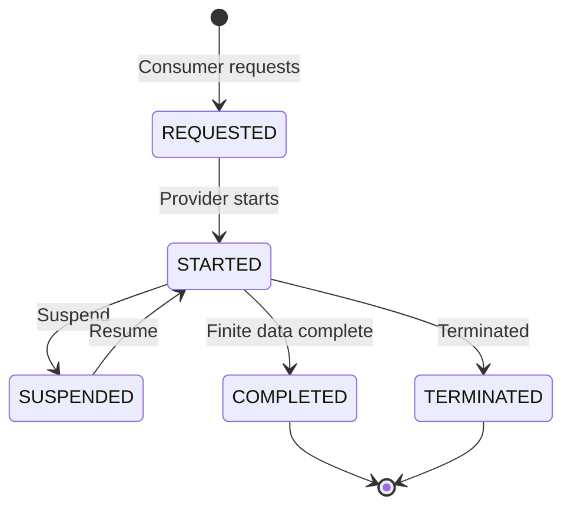
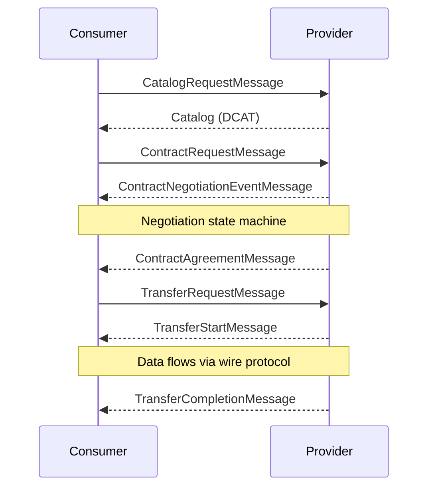
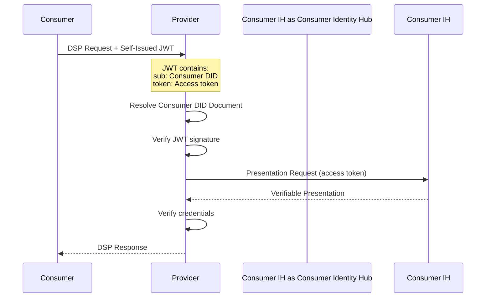
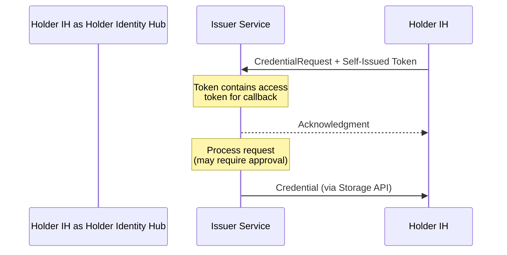
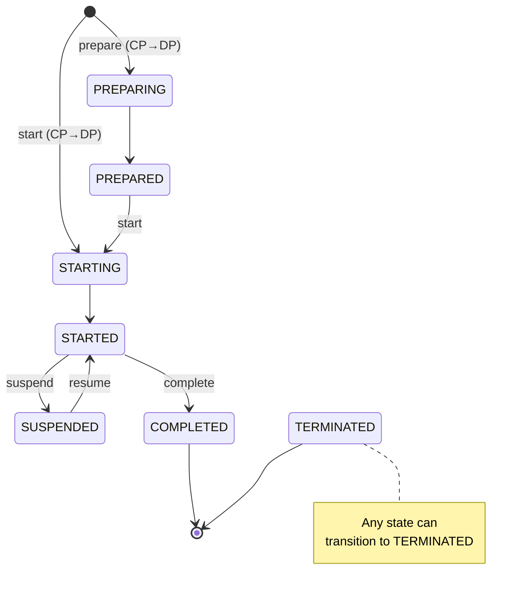
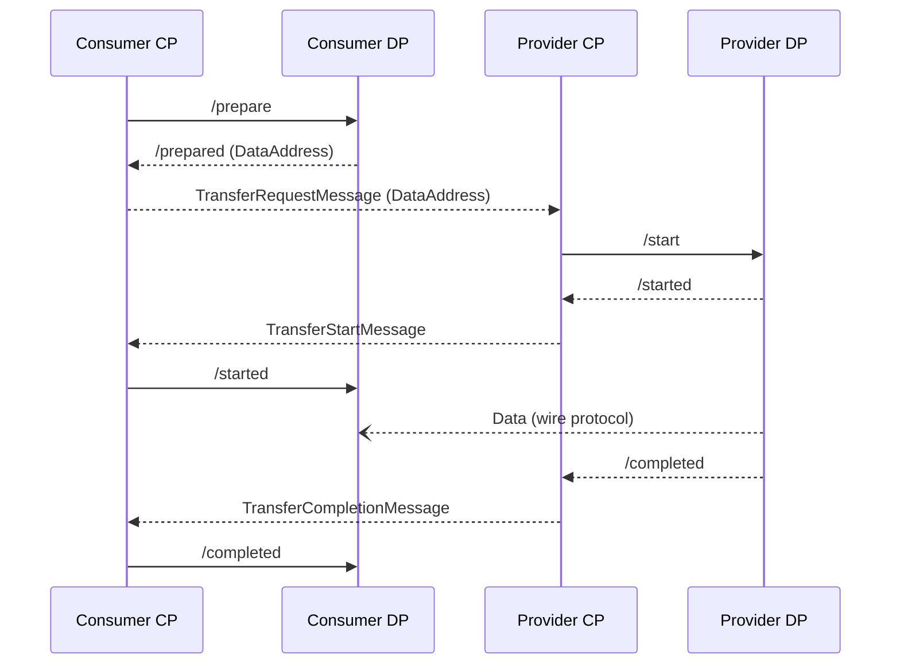
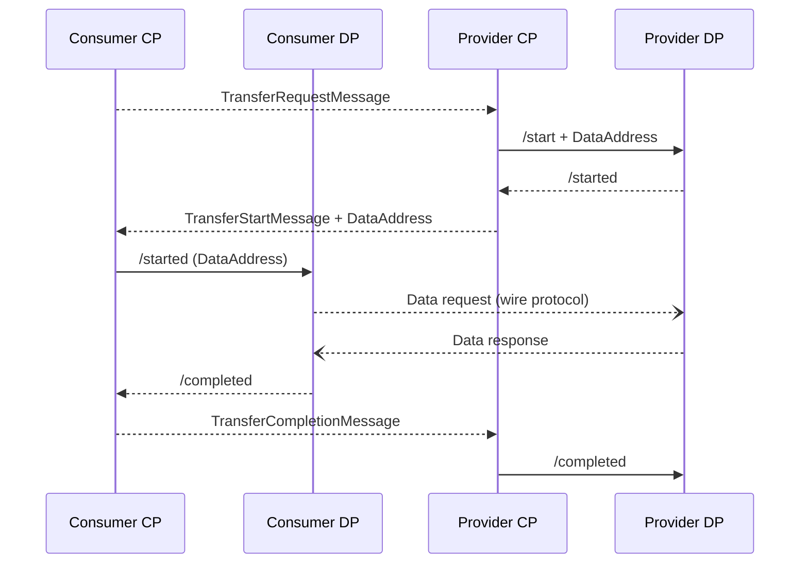
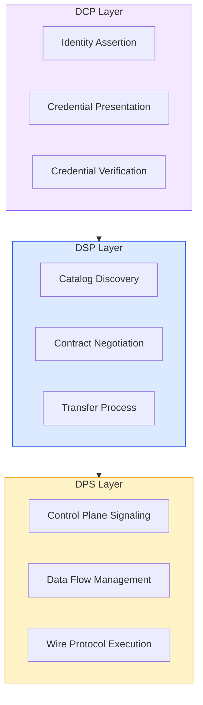

# Protocols

Dataspaces rely on three standard protocols to enable interoperability between different implementations. These protocols are developed under the Eclipse Foundation and define how connectors discover data, establish trust, negotiate agreements, and transfer data.

| Protocol | Purpose | Specification |
|----------|---------|---------------|
| **DSP** | Dataspace Protocol | Catalog, negotiation, transfer control |
| **DCP** | Decentralized Claims Protocol | Identity, credentials, trust |
| **DPS** | Data Plane Signaling | Control plane to data plane coordination |

---

## Dataspace Protocol (DSP)

The [Dataspace Protocol](https://eclipse-dataspace-protocol-base.github.io/DataspaceProtocol/2025-1/) is the core specification for interoperable data sharing. It defines the schemas and protocols required for entities to:

- **Publish data** via catalogs
- **Negotiate Agreements** that grant access
- **Access data** through transfer processes

### Key Concepts

#### Transfer Process

A Transfer Process models consumer access to a provider dataset in the control plane:



#### Data Transfer Types

DSP defines two fundamental transfer types:

| Type | Direction | Example |
|------|-----------|---------|
| **Push** | Provider → Consumer endpoint | File sent to consumer HTTP endpoint, event stream to consumer channel |
| **Pull** | Consumer ← Provider endpoint | Consumer fetches from provider API, subscribes to provider stream |

#### Finite vs. Non-Finite Data

| Data Type | Description | Completion |
|-----------|-------------|------------|
| **Finite** | Has a demarcated end (file, dataset) | Transfer completes when data is sent |
| **Non-Finite** | No specified end (stream, API) | Transfer continues until terminated |

### DSP Message Flow



### Catalog Structure

DSP catalogs use [DCAT](https://www.w3.org/TR/vocab-dcat-3/) vocabulary:

```json
{
  "@context": "https://w3id.org/dspace/2024/1/context.json",
  "@type": "dcat:Catalog",
  "dspace:participantId": "did:web:example.com",
  "dcat:dataset": [
    {
      "@id": "asset-1",
      "@type": "dcat:Dataset",
      "odrl:hasPolicy": { "@type": "odrl:Offer", "..." },
      "dcat:distribution": [
        {
          "@type": "dcat:Distribution",
          "dct:format": { "@id": "HttpData-PULL" },
          "dcat:accessService": { "..." }
        }
      ]
    }
  ]
}
```

### Contract Agreement

A Contract Agreement grants access to data and encodes usage policies as ODRL:

```json
{
  "@type": "odrl:Agreement",
  "@id": "urn:uuid:e8dc8655-44c2-46ef-b701-4cffdc2faa44",
  "odrl:target": "urn:uuid:3dd1add4-4d2d-569e-d634-8394a8836d23",
  "dspace:timestamp": "2023-01-01T01:00:00Z",
  "odrl:permission": [{
    "odrl:action": "odrl:use",
    "odrl:constraint": [{
      "odrl:leftOperand": "odrl:dateTime",
      "odrl:operator": "odrl:lteq",
      "odrl:rightOperand": { "@value": "2023-12-31T06:00Z", "@type": "xsd:dateTime" }
    }]
  }]
}
```

---

## Decentralized Claims Protocol (DCP)

The [Decentralized Claims Protocol](https://eclipse-dataspace-dcp.github.io/decentralized-claims-protocol/v1.0.1/) defines how participant identities and credentials are communicated to secure data access. It enables:

- **Asserting participant identities** without central authorities
- **Issuing verifiable credentials** from trusted issuers
- **Presenting verifiable credentials** for access control

### Why Decentralized?

DCP addresses the limitations of centralized identity systems:

| Concern | Centralized | DCP (Decentralized) |
|---------|-------------|---------------------|
| **Availability** | Single point of failure | No central dependency |
| **Privacy** | IdP sees all communications | No third-party visibility |
| **Control** | IdP controls tokens | Participants control identity |

### Self-Issued Tokens

DCP uses **self-issued tokens** instead of tokens from a central identity provider:

1. Requesting party generates and signs their own JWT
2. JWT `sub` claim contains the sender's Web DID
3. JWT is signed with a key from the sender's DID document
4. Receiving party verifies by resolving the DID document



### Presentation Flow

When a provider needs to verify consumer credentials:

1. **Resolve DID Document** — Get the consumer's DID document from the DID
2. **Locate CredentialService** — Find the `CredentialService` endpoint in the DID document
3. **Request Presentation** — Query the consumer's Identity Hub with required scopes
4. **Verify Credentials** — Validate the VP and contained VCs

### Credential Scopes

Presentation requests use scopes to specify required credentials:

```json
{
  "@context": [
    "https://w3id.org/tractusx-trust/v0.8",
    "https://identity.foundation/presentation-exchange/submission/v1"
  ],
  "@type": "PresentationQueryMessage",
  "scope": ["MembershipCredential", "AuditCertificationCredential"]
}
```

### Issuance Flow

DCP defines asynchronous credential issuance:



---

## Data Plane Signaling (DPS)

[Data Plane Signaling](https://github.com/eclipse-dataplane-signaling/dataplane-signaling) is the protocol used by control plane and data plane services to execute data transfers. It enables an ecosystem of compatible control plane and data plane implementations.

### Terminology

| Term | Definition |
|------|------------|
| **Control Plane** | Connector services implementing DSP |
| **Data Plane** | Connector services implementing wire protocols |
| **Data Flow** | Exchange of data using a wire protocol |
| **Wire Protocol** | Protocol for data exchange (HTTP, MQTT, S3, etc.) |
| **Transfer Process** | DSP-level abstraction in control plane |

### Data Flow State Machine

The Data Flow is a state machine managed by DPS:



| State | Description |
|-------|-------------|
| **PREPARING** | Provisioning resources for transfer |
| **PREPARED** | Ready to send/receive data |
| **STARTING** | Initiating wire protocol |
| **STARTED** | Wire protocol active |
| **SUSPENDED** | Transfer paused |
| **COMPLETED** | Transfer finished normally (terminal) |
| **TERMINATED** | Transfer ended before completion (terminal) |

### Data Address

A `DataAddress` conveys information to access a wire protocol endpoint:

```json
{
  "@type": "DataAddress",
  "endpointType": "https://w3id.org/idsa/v4.1/HTTP",
  "endpoint": "https://example.com/data",
  "endpointProperties": [
    {
      "@type": "EndpointProperty",
      "name": "authorization",
      "value": "TOKEN-123"
    },
    {
      "@type": "EndpointProperty",
      "name": "authType",
      "value": "bearer"
    }
  ]
}
```

### Push Transfer Flow

Provider pushes data to consumer-supplied endpoint:



### Pull Transfer Flow

Consumer pulls data from provider-supplied endpoint:



### Data Plane Registration

Data planes register with control planes to advertise capabilities:

```json
{
  "dataplaneId": "7d6fda82-98b6-4738-a874-1f2c003a79ff",
  "endpoint": "https://dataplane.example.com/signaling",
  "transferTypes": ["HttpData-PULL", "S3-PUSH", "AzureBlob-PUSH"],
  "labels": ["europe", "high-throughput"]
}
```

| Property | Purpose |
|----------|---------|
| **endpoint** | DPS signaling endpoint URL |
| **transferTypes** | Supported wire protocols and directions |
| **labels** | Tags for data plane selection |

### DPS API Endpoints

#### Data Plane Endpoints (called by Control Plane)

| Endpoint | Method | Purpose |
|----------|--------|---------|
| `/dataflows/prepare` | POST | Initialize data flow |
| `/dataflows/start` | POST | Begin data transfer |
| `/dataflows/:id/started` | POST | Notify consumer DP that transfer started |
| `/dataflows/:id/suspend` | POST | Pause transfer |
| `/dataflows/:id/terminate` | POST | End transfer |
| `/dataflows/:id/completed` | POST | Mark transfer complete |
| `/dataflows/:id/status` | GET | Query data flow state |

#### Control Plane Endpoints (called by Data Plane)

| Endpoint | Method | Purpose |
|----------|--------|---------|
| `/transfers/:id/dataflow/prepared` | POST | Signal PREPARED state |
| `/transfers/:id/dataflow/started` | POST | Signal STARTED state |
| `/transfers/:id/dataflow/completed` | POST | Signal COMPLETED state |
| `/transfers/:id/dataflow/errored` | POST | Signal terminal error |

---

## Protocol Relationships

The three protocols work together to enable secure data sharing:



| Layer | Role |
|-------|------|
| **DCP** | Establishes trust and verifies identity before DSP operations |
| **DSP** | Controls business logic—what data, under what terms, when |
| **DPS** | Executes the actual data transfer via wire protocols |

---

## Specification Links

- **DSP 2025-1**: [eclipse-dataspace-protocol-base.github.io](https://eclipse-dataspace-protocol-base.github.io/DataspaceProtocol/2025-1/)
- **DCP v1.0**: [eclipse-dataspace-dcp.github.io](https://eclipse-dataspace-dcp.github.io/decentralized-claims-protocol/v1.0.1/)
- **DPS**: [github.com/eclipse-dataplane-signaling](https://github.com/eclipse-dataplane-signaling/dataplane-signaling)

---

## What's Next

- **[Control Plane](/docs/architecture/control-plane)** — How DSP is implemented
- **[Identity Hub](/docs/architecture/identity-hub)** — How DCP is implemented
- **[Data Plane](/docs/architecture/data-plane)** — How DPS is implemented
