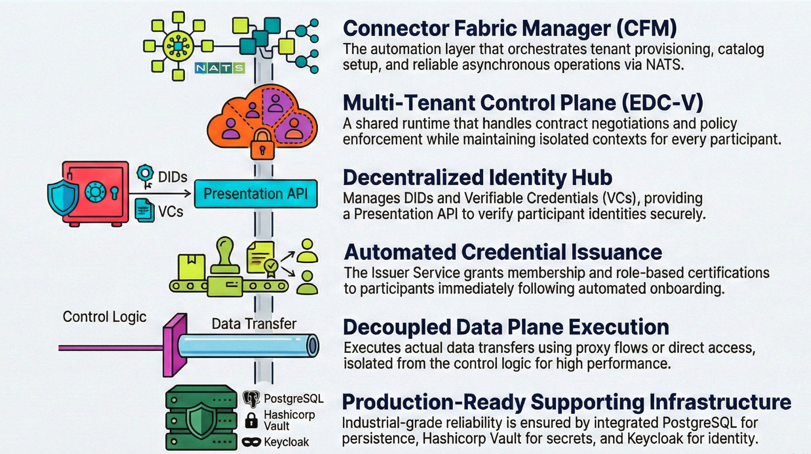
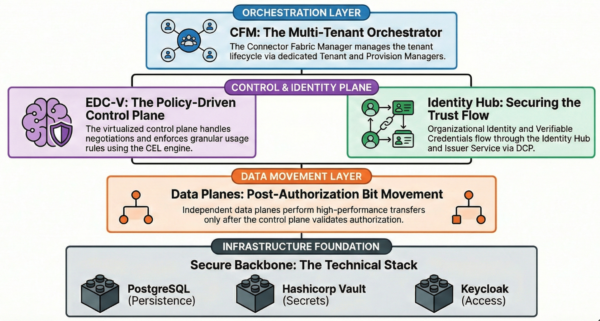

import Tabs from '@theme/Tabs';
import TabItem from '@theme/TabItem';

> **Target Audience**: Technical Decision Makers, Enterprise Architects, and Developers who need to run or extend the platform.

You cannot evaluate a dataspace by reading about it; you need to see it run. [**JAD (Just Another Demonstrator)**](https://github.com/Metaform/jad) is the reference implementation for a modern **Dataspace-as-a-Service** platform.

<!-- truncate -->

<!-- markdownlint-disable MD033 -->

## Why JAD Matters

Cloud providers evaluating dataspaces face a practical problem: how to offer the service without running a connector per customer. JAD solves this by demonstrating:

- **A complete, working deployment**: Full architecture, not a toy demo.
- **Multi-tenant control plane**:  [EDC-V](https://github.com/eclipse-edc/Virtual-Connector) keeps economics viable.
- **Automated tenant management**:  [Connector Fabric Manager (CFM)](https://github.com/Metaform/connector-fabric-manager) handles lifecycle.
- **End-to-end workflows**:  Onboarding, credentials, catalog, negotiation, data transfer.

## What is a Dataspace?

A dataspace is a network for sharing data with **sovereignty**: every exchange enforces identity, policy, and auditability so data owners retain control even after sharing.

## What’s In The Box

JAD deploys nine core services plus supporting infrastructure. Each component is introduced in the context of the running demo.



### Control Plane ([EDC-V](https://github.com/eclipse-edc/Virtual-Connector))

Multi-tenant control plane for negotiation and policy:

- Shared runtime with isolated participant contexts.
- Single deployment serves many tenants; per-tenant data planes when needed.

### [Identity Hub](https://github.com/eclipse-edc/IdentityHub)

Decentralized identity service:

- DIDs and Verifiable Credentials (VCs).
- Presentation API to verify credentials.

### [Issuer Service](https://github.com/eclipse-edc/IdentityHub) <!-- placeholder link; replace when issuer service repo is available -->

Credential issuance aligned to governance:

- Issues VCs after onboarding.
- Supports multiple credential types (membership, certifications, roles).

### Data Plane ([EDC Connector](https://github.com/eclipse-edc/Connector))

Executes the actual data transfer:

- Proxy transfers; direct access with tokens; file/certificate sharing flows.

### [Connector Fabric Manager (CFM)](https://github.com/Metaform/connector-fabric-manager)

Automation layer for service providers:

- Tenant provisioning and catalog setup.
- Credential orchestration and storage.
- Agent-based workflows over NATS for reliable async operations.

### Supporting Infrastructure

| Component | Purpose |
| --- | --- |
| [PostgreSQL](https://www.postgresql.org/) | Persistent state for all components |
| [HashiCorp Vault](https://www.vaultproject.io/) | Secrets management (keys, tokens) |
| [NATS](https://nats.io/) | Async messaging for CFM orchestration |
| [Keycloak](https://www.keycloak.org/) | OAuth2 authentication for APIs |
| [Traefik](https://traefik.io/) | Gateway controller for external access |

## JAD Architecture Overview



- CFM orchestrates tenant lifecycle across core services.
- Control plane (EDC-V) handles negotiation and policy; identity flows through Identity Hub and Issuer Service; data planes move the bits after authorization.
- State lives in PostgreSQL; secrets in Vault; access secured via Keycloak.

## Getting JAD Running (KinD)

### Prerequisites

- Docker, KinD, kubectl, Helm, Java 17+ (if building), Bruno (for API testing).

<details>
<summary>Building from source (optional)</summary>

```bash
./gradlew dockerize
kind load docker-image \
  ghcr.io/metaform/jad/controlplane:latest \
  ghcr.io/metaform/jad/identity-hub:latest \
  ghcr.io/metaform/jad/issuerservice:latest \
  ghcr.io/metaform/jad/dataplane:latest -n edcv
```

If you use local images, set `imagePullPolicy: Never` in manifests.

</details>

### Step 1: Create the Cluster

```bash
cp ~/.kube/config ~/.kube/config.bak
kind create cluster -n edcv --kubeconfig ~/.kube/edcv-kind.conf
ln -sf ~/.kube/edcv-kind.conf ~/.kube/config
```

### Step 2: Install Traefik Gateway + Gateway API

```bash
helm repo add traefik https://traefik.github.io/charts
helm repo update
helm upgrade --install --namespace traefik traefik traefik/traefik \
  --create-namespace -f values.yaml

kubectl apply --server-side --force-conflicts \
  -f https://github.com/kubernetes-sigs/gateway-api/releases/download/v1.4.1/experimental-install.yaml
```

### Step 3: Network Access (pick one)

<Tabs>
  <TabItem value="port-forward" label="Port Forward (local)">

  ```bash
  kubectl -n traefik port-forward svc/traefik 80
  ```

  </TabItem>
  <TabItem value="loadbalancer" label="LoadBalancer (cloud-like)">

  Install cloud-provider-kind, then verify external IP:

  ```bash
  kubectl get svc -n traefik
  ```

  </TabItem>
</Tabs>

### Step 4: Deploy JAD

```bash
kubectl apply -f k8s/base/
kubectl wait --namespace edc-v --for=condition=ready pod --selector=type=edcv-infra --timeout=90s
kubectl apply -f k8s/apps/
kubectl wait --namespace edc-v --for=condition=complete job --all --timeout=90s
```

### Step 5: Verify

```bash
kubectl get deployments -n edcv
kubectl get jobs -n edcv
```

### Accessing Services

| Service | URL | Credentials |
| --------- | ----- | ------------- |
| PostgreSQL | jdbc:postgresql://postgres.localhost/controlplane | cp / cp |
| Vault | [http://vault.localhost](http://vault.localhost) | Token: root |
| Keycloak | [http://keycloak.localhost](http://keycloak.localhost) | admin / admin |

⚠️ Demo credentials only—never use in production.

## Walking Through the Demo (step by step)

Use the Bruno collection in the repo ([requests/EDC-V Onboarding](https://github.com/Metaform/jad/tree/main/requests/EDC-V%20Onboarding)) to run these steps without crafting payloads manually.

### Step 1: Provision participants (CFM)

1. In [Bruno](https://www.usebruno.com/), open **CFM - Provision Consumer** then **CFM - Provision Provider** and send both requests.
2. Check **Get Participant Profile** until every entry in `vpas` shows `"state": "active"` (CFM has created keys, DID, credentials, and catalog wiring).

### Step 2: Seed the provider with data

1. In **Policy - Create CEL Expression**, post the example expression.
2. In **Asset - Create Asset**, register the asset to be shared.
3. In **Policy - Create Access Policy**, define who can access.
4. In **ContractDefinition - Create**, link asset + policy to publish to the catalog.

### Step 3: Execute a transfer

<Tabs>
  <TabItem value="http" label="HTTP Proxy Transfer">

  1. Consumer calls **Catalog - Query** to find the offer.
  2. Consumer sends **ContractNegotiation - Initiate** with required credentials.
  3. On agreement, consumer calls **Transfer - Start HTTP Proxy**; control plane signals the data plane; download the payload from the returned endpoint.

  </TabItem>
  <TabItem value="cert" label="Certificate Sharing">

  1. Provider uploads a document via **Data Management - Upload**.
  2. Consumer queries catalog and finds the certificate asset.
  3. Consumer initiates **ContractNegotiation - Initiate** with credentials.
  4. Consumer downloads the certificate from the negotiated transfer link.

  </TabItem>
</Tabs>

## What Cloud Providers Should Study

- **Multi-tenancy**: ParticipantContext model in EDC-V for density and isolation.
- **CFM agent architecture**: Extensible, retryable operations (Vault, DNS, credential agents).
- **API surface**: CFM Tenant API (provisioning), Management API (assets/policies/contracts), Identity API, DSP endpoints.
- **Operational patterns**: Init jobs, dependency ordering, readiness probes, secrets in Vault.

## Extending JAD for Your Environment

- Replace infrastructure (managed DB, managed secrets, HA/backup).
- Add your UI layer (onboarding portal, data management, ops dashboard).
- Integrate billing/metering at CFM lifecycle hooks.
- Adapt manifests for your load balancer, DNS, network policies, and monitoring.

## Common Questions

**Can I run JAD in production?** No, use it as a blueprint and harden for production.

**How do credentials get issued?** Issuer Service issues VCs; authorization to issue comes from dataspace governance.

**How does this relate to MVD?** [Minimum Viable Dataspace](https://github.com/eclipse-edc/MinimumViableDataspace) is a two-connector sandbox. JAD shows the hosted, multi-tenant service architecture.

## Resources

- [JAD Repository](https://github.com/Metaform/jad)
- [Connector Fabric Manager](https://github.com/Metaform/connector-fabric-manager)
- [Redline UI](https://github.com/Metaform/redline)
- [EDC-V (Virtual Connector)](https://github.com/eclipse-edc/Virtual-Connector)
- [Identity Hub](https://github.com/eclipse-edc/IdentityHub)
- [DSP TCK](https://github.com/eclipse-dataspacetck/dsp-tck) and [DCP TCK](https://github.com/eclipse-dataspacetck/dcp-tck)
- [EDC Compatibility Matrix](https://eclipse-edc.github.io/documentation/compatibility/)