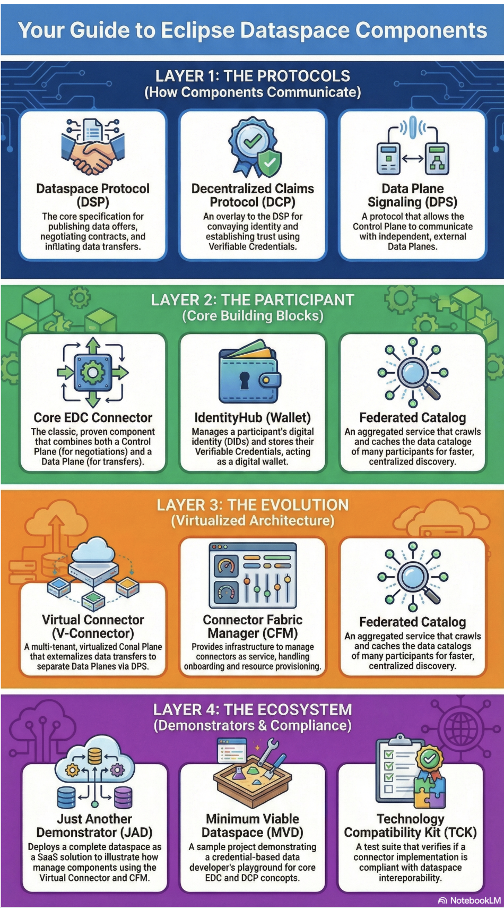

In the rapidly evolving landscape of data ecosystems, consulting companies play a pivotal role. Clients are no longer just asking "how do I store my data?" but "how do I share it securely and profitably?" As a Cloud & Dataspace Architect working in the consulting sector, I see firsthand how organizations struggle to bridge the gap between their internal data silos and the collaborative potential of dataspaces.

This guide outlines how consulting firms can build a portfolio of value-added services (VAS) that enable clients to participate in dataspaces. We will cover the end-to-end journey: from establishing identity and security to defining data products, managing contracts, and leveraging regulations as a driver for adoption.

{/* truncate */}

## The Consulting Opportunity in Dataspaces

The shift to federated data sharing represents a major market opportunity for consultancies. It's not just about installing software; it's about architecting trust, governance, and business models. To capture this value, consulting firms must extend their offerings to include:

*   **Management Consulting**: Guiding clients through the strategic adoption of decentralized technologies.
*   **Data Monetization Strategy**: Designing business models to turn data assets into revenue streams.
*   **Network Effect**: Strategizing on how to build and grow the ecosystem to increase value for all participants.
*   **Data Governance & Auditing**: Establishing the rules of engagement and ensuring automated logical compliance.
*   **Security & Privacy**: Implementing **Zero Trust** architectures (referencing the [NIST Implementation Guide](https://www.nccoe.nist.gov/projects/implementing-zero-trust-architecture)), **End-to-End (E2E) Encryption**, and **Confidential Compute** environments.
*   **Sovereign Data Storage**: Ensuring data resides in compliant, sovereign infrastructure.
*   **Data Transformation**: Mapping and converting internal data schemas to interoperable standards.
*   **Evolving Data Products**: moving from static datasets to managed, evolving data products.
*   **Data Mesh Architecture**: Extending the Data Mesh concept to serve external customers and partners.

:::info Strategy Tip
Consulting firms should position themselves not just as integrators, but as **Eco-system Enablers**. The value lies in helping clients navigate the complexity of multi-party data sharing.
:::

## Understanding the EDC Layers: The Consultant's Map

To effectively advise clients, consultants must understand the architectural map of the Eclipse Dataspace Components. The diagram below organizes the technology into four logical layers, moving from the foundational protocols up to the ecosystem tooling.

### Layer 1: The Protocols (How Components Communicate)
This is the "Step-by-Step" language of the dataspace. These are the open standards that ensure interoperability, regardless of vendor.
*   **Dataspace Protocol (DSP)**: The core specification for publishing data offers, negotiating contracts, and initiating transfers. It is the "handshake".
*   **Decentralized Claims Protocol (DCP)**: An overlay to the DSP for verifying identity. It uses Verifiable Credentials to establish trust before any data is shared.
*   **Data Plane Signaling (DPS)**: The protocol that bridges the "Brain" (Control Plane) with the "Muscle" (Data Plane), allowing them to run on separate infrastructure.
*   **Consulting Task**: Ensure clients are not building proprietary APIs but are adhering to these standards for future-proof interoperability.

### Layer 2: The Participant (Core Building Blocks)
These are the actual software components your client needs to deploy to become a member of the dataspace.
*   **[Core EDC Connector](https://github.com/eclipse-edc/Connector)**: The standard software piece that combines negotiation (Control Plane) and transfer (Data Plane).
*   **[IdentityHub (Wallet)](https://github.com/eclipse-edc/IdentityHub)**: The digital safe. It holds the generic identity (DID) and the specific credentials (e.g., ISO certifications) that allow the connector to prove who it is.
*   **[Virtual Connector](https://github.com/eclipse-edc/Virtual-Connector)**: A multi-tenant architecture that allows you, as a service provider, to host "Connectors-as-a-Service" for multiple clients efficiently.
*   **[Connector Fabric Manager (CFM)](https://projects.eclipse.org/proposals/eclipse-connector-fabric-manager)**: The management layer for provisioning and onboarding these connectors at scale.
*   **Consulting Task**: Architecture design. Deciding whether a client needs a dedicated Core Connector (high security/isolation) or can be onboarded via a managed Virtual Connector (lower cost/complexity).

### Layer 3: The Network (The Glue)
These services do not belong to one single participant but facilitate the network effect.
*   **[Federated Catalog](https://github.com/eclipse-edc/FederatedCatalog)**: An aggregated service that crawls the decentralized network. It caches metadata so users can search across thousands of data offers instantly, rather than querying every connector individually.
*   **Consulting Task**: Discovery Strategy. Ensuring your client's data assets are properly indexed in the Federated Catalog so they can be found by potential buyers.

### Layer 4: The Ecosystem (Demonstrators & Compliance)
The tools used to validate, demonstrate, and test the system.
*   **[Just Another Demonstrator (JAD)](https://github.com/Metaform/jad)**: A complete "Dataspace-as-a-Service" reference implementation. Use this to show stakeholders a working system immediately.
*   **[Minimum Viable Dataspace (MVD)](https://github.com/eclipse-edc/MinimumViableDataspace)**: A developer-focused sandbox for understanding the code and testing concepts locally.
*   **[Technology Compatibility Kit (TCK)](https://github.com/eclipse-dataspacetck)**: The test suite. If your client builds a custom connector, this tool verifies it is compliant with the official standards.
*   **Consulting Task**: Rapid Prototyping & Quality Assurance. Use JAD/MVD to build Proof of Concepts (PoCs) quickly, and use the TCK to validate any custom development.

:::tip Key Standards Cheat Sheet
| Acronym | Full Name | Purpose |
| :--- | :--- | :--- |
| **[DSP](https://eclipse-dataspace-protocol-base.github.io/DataspaceProtocol/)** | Dataspace Protocol | The core standard for negotiating contracts and transfers. |
| **[DCP](https://eclipse-dataspace-dcp.github.io/decentralized-claims-protocol/)** | Decentralized Claims Protocol | Handles identity, trust, and verified credentials. |
| **[DPS](https://projects.eclipse.org/projects/technology.dataplane-signaling)** | Data Plane Signaling | Manages the technical data flow between planes. |
| **[DCAT](https://www.w3.org/TR/vocab-dcat-3/)** | W3C Data Catalog | The standard structure for describing data offerings. |
| **[ODRL](https://www.w3.org/TR/odrl-model/)** | Open Digital Rights Language | The language used to write usage policies (e.g., "expire after 2 days"). |
| **[DID](https://www.w3.org/TR/did-core/)** | Decentralized Identifier | A unique ID for an organization or asset, independent of a central registry. |
:::

## 1. Integrating Identity and Security

The foundation of any dataspace is trust, but for many participants, the complexity of [**Decentralized Identity (DID)**](https://www.w3.org/TR/did-core/) and [**Verifiable Credentials (VC)**](https://www.w3.org/TR/vc-data-model/) is a significant barrier to entry. Consultants can address this by offering **Identity Management Integration** services. This involves integrating a client's existing Identity Providers (IdP) with the dataspace's Identity Hubs, effectively bridging corporate IT with the decentralized web. Furthermore, consultants manage the issuance and verification of credentials—such as ISO certifications or business registry checks—ensuring that every participant in the network is who they claim to be. This approach ensures that Zero Trust principles are applied not just at the network perimeter, but to every individual data endpoint.

## 2. Data Models and Digital Twins

Data cannot be successfully shared if it cannot be understood by the recipient. A critical service area lies in **Semantic Modeling & Digital Twin Design**, where consultants map a client’s internal data structures to industry-standard semantic models. By creating Digital Twins that represent physical assets like machines and vehicles, or logical entities like supply chains, consultants ensure data has context.

Utilizing standards such as the [**Asset Administration Shell**](https://github.com/admin-shell-io/aas-specs) (AAS) [submodels](https://industrialdigitaltwin.org/en/content-hub/submodels) from [IDTA](https://industrialdigitaltwin.org/en/) allows for structured data representation, widely used in Industry 4.0 to capture the entire lifecycle of industrial assets. Beyond AAS, other key standards are crucial for consultants to know:

*   [**OPC UA**](https://opcfoundation.org/about/opc-technologies/opc-ua/): The standard for industrial automation. Its rich information model allows you to represent complex machines and sensors structurally, serving as the semantic "lingua franca" on the shop floor.
*   [**ISA-95**](https://www.isa.org/standards-and-publications/isa-standards/isa-standards-committees/isa95): The international standard for integrating enterprise and control systems. It provides the hierarchy and vocabulary (e.g., "Job Order", "Material Lot") needed to bridge the gap between OT (Operational Technology) and IT (Information Technology) systems.
*   [**NGSI-LD**](https://www.etsi.org/technologies/smart-cities): An ETSI standard extensively used in Smart City and Agri-Food dataspaces. It provides a formal way to structure context information (e.g., "What is the status of this parking spot?" or "What is the humidity of this field?"), allowing real-time data to be easily queried and integrated.
*   [**Digital Twins Definition Language (DTDL)**](https://github.com/Azure/Opendigitaltwins-dtdl): An open modeling language originally developed by Microsoft. It uses JSON-LD to describe models of devices, spaces, and processes in a graph structure, making it highly effective for modeling complex environments like buildings or energy grids.
*   [**HL7 FHIR**](https://hl7.org/fhir/): The dominant standard for healthcare data exchange. It defines resources (like Patient, Observation, Medication) using modern web technologies, enabling interoperable health dataspaces where clinical data can be shared securely between hospitals and researchers.

Adopting these domain-specific ontologies guarantees interoperability, allowing diverse systems to communicate without costly point-to-point integration.

## 3. The Data Catalog: Discovery data offers

In a distributed network, visibility is currency. Clients need their data products to be discoverable by potential partners without exposing the raw data itself. Through **Catalog Management & Publication** services, consultants map internal data metadata to the [**W3C DCAT**](https://www.w3.org/TR/vocab-dcat-3/) standard, transforming opaque database tables into clearly defined "Data Offerings" linked to Digital Twins. Implementing Federated Catalog nodes allows these offerings to be broadcast to the network, enabling clients to search for and discover complementary datasets from other partners, fostering a true marketplace of information.

## 4. Contract Negotiations and Management

Access control in a dataspace is governed not by static permissions, but by legally binding usage policies encoded as digital contracts. Consultants provide **Smart Contract & Policy Engineering** to define these usage policies—specifying, for example, that data can only be used for AI training or must be deleted after a set period. By automating the negotiation handshake using the [**Dataspace Protocol**](https://eclipse-dataspace-protocol-base.github.io/DataspaceProtocol/), the friction of manual legal review is removed. This service manages the entire lifecycle of contracts, from creation and signing to validity checks and termination, ensuring that business rules are enforced technically.

## 5. Audit, Monitoring, and Monetization

Trust requires verification. Once data is flowing, clients need assurance that it is being used correctly and, where applicable, that they are being compensated. Consultants can build **Compliance Auditing & Monetization Strategies** that deploy specific logging and clearing house services to record every transfer agreement. Beyond simple logging, this involves building dashboards that track actual data usage against contract terms. On the commercial side, consultants design flexible pricing models—whether subscription-based or pay-per-use—and integrate them with payment clearing systems to automate revenue collection.

## 6. Regulations as a Driver

Compliance is often viewed as a burden, but in the context of dataspaces, it is a powerful catalyst. Regulations such as the [**EU Data Act**](https://digital-strategy.ec.europa.eu/en/policies/data-act), [**GDPR**](https://gdpr.eu/), and the [**Digital Product Passport (DPP)**](https://commission.europa.eu/strategy-and-policy/policies/green-deal-industrial-plan_en) inherently mandate data sharing, portability, and transparency. The strategic consulting angle here helps clients view these obligations not as costs, but as competitive advantages. By implementing a dataspace architecture, compliance becomes a byproduct of the technical design rather than a manual afterthought, future-proofing the organization against evolving legal requirements.

## 7. Strategic Domain Focus & Market Analytics

A "one-size-fits-all" approach rarely yields results in specialized B2B ecosystems. Consultancies must carefully analyze the market to select the right domains for their services.

### Market Analytics for Domain Selection

To maximize impact, specific domains stand out due to their characteristics. **High Asset Value** sectors like Manufacturing, Automotive, and Energy justify the investment in complex data sharing infrastructure. Areas under **Regulatory Pressure**, such as those requiring ESG reporting (CSRD) or Battery Passports, create immediate demand for compliance solutions. Finally, industries characterized by **Fragmentation**, like Logistics and Supply Chain, offer the greatest opportunity for value add, as they require many disparate players to coordinate seamlessly.

### Strategy

Success in these areas requires **Vertical Specialization**. Consultancies should aim to build deep expertise in specific domain standards, such as [**Catena-X**](https://catena-x.net/) for automotive, rather than generalist knowledge. Offering **Pre-packaged Solutions**, such as a "Dataspace-in-a-Box" for specific use cases like CO2 footprint tracking, can significantly lower the barrier to entry for clients and accelerate adoption.

---

By mastering these pillars, consulting companies can transform from simple service providers into indispensable architects of the new data economy.
