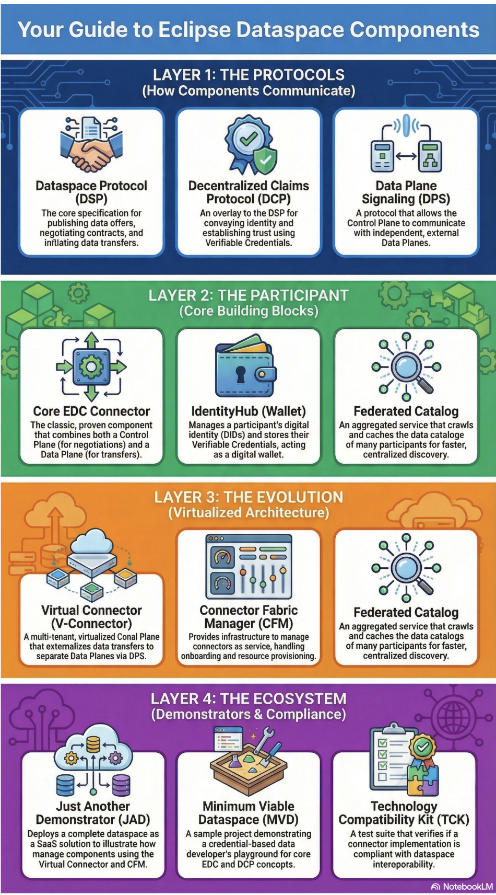
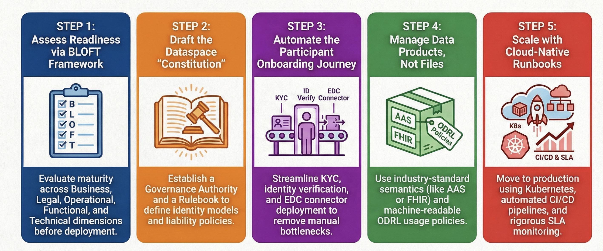
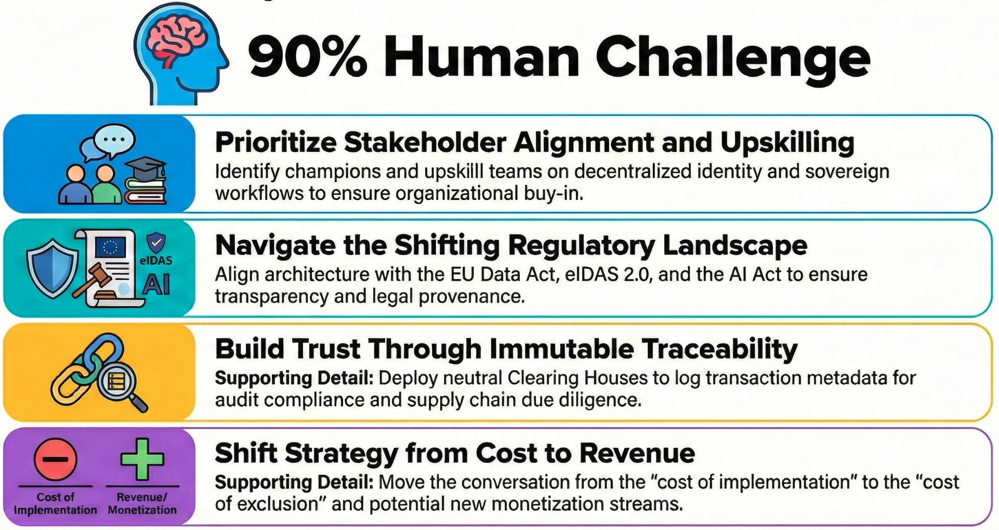

In the rapidly evolving landscape of data ecosystems, consulting companies play a pivotal role. Clients are no longer just asking "how do I store my data?" but "how do I share it securely and profitably?"

For consultancies, building expertise in dataspaces is now a critical investment. The **European Commission** and national governments are aggressively funding the development of data ecosystems to secure digital sovereignty. This public push is reinforced by a regulatory tsunami: the **Data Act**, enabling users to access data generated by their devices, and the **Data Governance Act**, creating a framework for neutral data intermediaries. These regulations are creating a new market reality where the ability to share data in a compliant, sovereign manner is a license to operate.

As a Cloud & Dataspace Architect working in the consulting sector, I see firsthand how organizations struggle to bridge the gap between their internal data silos and the collaborative potential of dataspaces.

This guide outlines how consulting firms can build a portfolio of value-added services (VAS) that enable clients to participate in dataspaces. We will cover the end-to-end journey: from establishing identity and security to defining data products, managing contracts, and leveraging regulations as a driver for adoption.

{/* truncate */}

## The Consulting Opportunity in Dataspaces

The shift to federated data sharing represents a major market opportunity for consultancies. It's not just about installing software; it's about architecting trust, governance, and business models. To capture this value, consulting firms must extend their offerings to include:

*   **Management Consulting**: Guiding clients through the strategic adoption of decentralized technologies.
*   **Data Monetization Strategy**: Designing business models to turn data assets into revenue streams.
*   **Network Effect**: Strategizing on how to build and grow the ecosystem to increase value for all participants.
*   **Data Governance & Auditing**: Establishing the rules of engagement and ensuring automated logical compliance.
*   **Security & Privacy**: Implementing **Zero Trust** architectures (referencing the [NIST Implementation Guide](https://www.nccoe.nist.gov/projects/implementing-zero-trust-architecture)), **End-to-End (E2E) Encryption**, and **Confidential Compute** environments.
*   **Sovereign Data Storage**: Ensuring data resides in compliant, sovereign infrastructure.
*   **Data Transformation**: Mapping and converting internal data schemas to interoperable standards.
*   **Evolving Data Products**: moving from static datasets to managed, evolving data products.
*   **Data Mesh Architecture**: Extending the Data Mesh concept to serve external customers and partners.

:::info Strategy Tip
Consulting firms should position themselves not just as integrators, but as **Eco-system Enablers**. The value lies in helping clients navigate the complexity of multi-party data sharing.
:::

## Understanding the EDC Layers: The Consultant's Map

To effectively advise clients, consultants must understand the architectural map of the Eclipse Dataspace Components. The diagram below organizes the technology into four logical layers, moving from the foundational protocols up to the ecosystem tooling.

### Layer 1: The Protocols (How Components Communicate)
This is the "Step-by-Step" language of the dataspace. These are the open standards that ensure interoperability, regardless of vendor.
*   **Dataspace Protocol (DSP)**: The core specification for publishing data offers, negotiating contracts, and initiating transfers. It is the "handshake".
*   **Decentralized Claims Protocol (DCP)**: An overlay to the DSP for verifying identity. It uses Verifiable Credentials to establish trust before any data is shared.
*   **Data Plane Signaling (DPS)**: The protocol that bridges the "Brain" (Control Plane) with the "Muscle" (Data Plane), allowing them to run on separate infrastructure.
*   **Consulting Task**: Ensure clients are not building proprietary APIs but are adhering to these standards for future-proof interoperability.

### Layer 2: The Participant (Core Building Blocks)
These are the actual software components your client needs to deploy to become a member of the dataspace.
*   **[Core EDC Connector](https://github.com/eclipse-edc/Connector)**: The standard software piece that combines negotiation (Control Plane) and transfer (Data Plane).
*   **[IdentityHub (Wallet)](https://github.com/eclipse-edc/IdentityHub)**: The digital safe. It holds the generic identity (DID) and the specific credentials (e.g., ISO certifications) that allow the connector to prove who it is.
*   **[Virtual Connector](https://github.com/eclipse-edc/Virtual-Connector)**: A multi-tenant architecture that allows you, as a service provider, to host "Connectors-as-a-Service" for multiple clients efficiently.
*   **[Connector Fabric Manager (CFM)](https://projects.eclipse.org/proposals/eclipse-connector-fabric-manager)**: The management layer for provisioning and onboarding these connectors at scale.
*   **Consulting Task**: Architecture design. Deciding whether a client needs a dedicated Core Connector (high security/isolation) or can be onboarded via a managed Virtual Connector (lower cost/complexity).

### Layer 3: The Network (The Glue)
These services do not belong to one single participant but facilitate the network effect.
*   **[Federated Catalog](https://github.com/eclipse-edc/FederatedCatalog)**: An aggregated service that crawls the decentralized network. It caches metadata so users can search across thousands of data offers instantly, rather than querying every connector individually.
*   **Consulting Task**: Discovery Strategy. Ensuring your client's data assets are properly indexed in the Federated Catalog so they can be found by potential buyers.

### Layer 4: The Ecosystem (Demonstrators & Compliance)
The tools used to validate, demonstrate, and test the system.
*   **[Just Another Demonstrator (JAD)](https://github.com/Metaform/jad)**: A complete "Dataspace-as-a-Service" reference implementation. Use this to show stakeholders a working system immediately.
*   **[Minimum Viable Dataspace (MVD)](https://github.com/eclipse-edc/MinimumViableDataspace)**: A developer-focused sandbox for understanding the code and testing concepts locally.
*   **[Technology Compatibility Kit (TCK)](https://github.com/eclipse-dataspacetck)**: The test suite. If your client builds a custom connector, this tool verifies it is compliant with the official standards.
*   **Consulting Task**: Rapid Prototyping & Quality Assurance. Use JAD/MVD to build Proof of Concepts (PoCs) quickly, and use the TCK to validate any custom development.

:::tip Key Standards Cheat Sheet
| Acronym | Full Name | Purpose |
| :--- | :--- | :--- |
| **[DSP](https://eclipse-dataspace-protocol-base.github.io/DataspaceProtocol/)** | Dataspace Protocol | The core standard for negotiating contracts and transfers. |
| **[DCP](https://eclipse-dataspace-dcp.github.io/decentralized-claims-protocol/)** | Decentralized Claims Protocol | Handles identity, trust, and verified credentials. |
| **[DPS](https://projects.eclipse.org/projects/technology.dataplane-signaling)** | Data Plane Signaling | Manages the technical data flow between planes. |
| **[DCAT](https://www.w3.org/TR/vocab-dcat-3/)** | W3C Data Catalog | The standard structure for describing data offerings. |
| **[ODRL](https://www.w3.org/TR/odrl-model/)** | Open Digital Rights Language | The language used to write usage policies (e.g., "expire after 2 days"). |
| **[DID](https://www.w3.org/TR/did-core/)** | Decentralized Identifier | A unique ID for an organization or asset, independent of a central registry. |
:::

## 1. Strategy & Assessment

The common journey of the customer and the consulting company begins with valid strategy. Consultants must first assess organizational readiness and define the business case using quantitative frameworks.

*   **Dataspace Readiness Assessment (BLOFT)**: Evaluate client maturity across five dimensions: **B**usiness (strategy), **L**egal (IPR), **O**perational (processes), **F**unctional (requirements), and **T**echnical (infrastructure).
*   **ROI Frameworks & Business Cases**: Shift the conversation from IT cost to business value. Quantify the value of data sharing through direct monetization, operational efficiency, or regulatory risk reduction.

:::note Further Reading
*   [**DSSC Starter Kit**](https://dssc.eu/space/DSSC/175866160/Starter+Kit): The essential entry point for strategizing new dataspaces.
*   [**Sitra Rulebook for a Fair Data Economy**](https://www.sitra.fi/en/projects/rulebook-for-a-fair-data-economy/): A comprehensive guide on business models and data economy structures.
:::

## 2. Governance Framework Design

A governance framework is the "Constitution" of the dataspace. Consultants play a critical role in drafting the **Data Sharing Governance Authority (DSGA)** structure and the Rulebook.

*   **Trust Framework Architecture**: Defining the **Trust Anchors** (e.g., X.509 CAs, DID methods) that underpin the identity model.
*   **Rulebook Creation**: Drafting the legal and technical policies that all participants must sign, governing liability, dispute resolution, and technical standards.

:::note Further Reading
*   [**DSSC Blueprint - Governance**](https://dssc.eu/space/DSSC/175866155/Blueprint): The architectural reference for dataspace governance models.
*   [**Gaia-X Trust Framework**](https://gaia-x.eu/wp-content/uploads/2022/05/Gaia-X-Trust-Framework-22.04.pdf): A deep dive into trust anchors and compliance service design.
:::

## 3. The Participant Onboarding Journey

Aligning with the [DSSC Co-creation method](https://dssc.eu/page/dssc-co-creation-method), consultants should guide clients through a structured lifecycle:

1.  **Onboarding & KYC**: Verifying the legal entity. This involves integrating existing Identity Providers (IdP) with the [**IdentityHub**](https://github.com/eclipse-edc/IdentityHub) and issuance of [**Verifiable Credentials (VC)**](https://www.w3.org/TR/vc-data-model/).
2.  **Assessment & Compliance**: Checking internal data governance against the Rulebook.
3.  **Technical Integration**: Deploying the [**Core EDC Connector**](https://github.com/eclipse-edc/Connector) or onboarding via a [**Virtual Connector**](https://github.com/eclipse-edc/Virtual-Connector).
4.  **Testing & Certification**: Using the [**Technology Compatibility Kit (TCK)**](https://github.com/eclipse-dataspacetck) to validate compliance before going live.

## 4. Data Product Development Methodology

In a dataspace, you don't share "files"; you manage "Data Products". This methodology covers the entire product lifecycle:

*   **Definition & Semantics**: Mapping internal data structures to industry standards to ensure context.
    *   **Industry 4.0**: Use [**Asset Administration Shell (AAS)**](https://github.com/admin-shell-io/aas-specs) and [**OPC UA**](https://opcfoundation.org/about/opc-technologies/opc-ua/).
    *   **Smart City**: Leverage [**NGSI-LD**](https://www.etsi.org/technologies/smart-cities) for context information.
    *   **Digital Twins**: Model complex environments with [**DTDL**](https://github.com/Azure/Opendigitaltwins-dtdl).
    *   **Healthcare**: Adopt [**HL7 FHIR**](https://hl7.org/fhir/) for interoperability.
*   **Discovery & Packaging**: Publishing data offerings to the [**Federated Catalog**](https://github.com/eclipse-edc/FederatedCatalog) using standard profiles like [**DCAT-AP**](https://semiceu.github.io/DCAT-AP/releases/) or sector-specific ones like **HealthDCAT-AP** and **MobilityDCAT-AP**.
*   **Policy Definition**: Using [**ODRL**](https://www.w3.org/TR/odrl-model/) to craft machine-readable usage policies (e.g., "AI training allowed", "Delete after 30 days").

## 5. Operations: The Runbook

Operational Excellence is critical for stability. The runbook defines:
*   **Deployment Patterns**: Blueprints for deploying Connectors on cloud-native Frameworks like Kubernetes (K8s) or bare metal with Indfrastructure as Code (IaC) tools like OpenTofu and Helm, ArgoCD and Flux.
*   **CI/CD & Monitoring**: Pipelines for connector updates and dashboards for monitoring contract negotiations and transfer health.
*   **Incident Management**: SLAs and procedures for when data transfers fail or connectors go offline.

:::note Further Reading
*   [**Eclipse EDC Samples**](https://github.com/eclipse-edc/Samples): Practical runbook examples and deployment configurations.
*   [**Catena-X Operating Model**](https://catena-x.net/en/catena-x-introduce-implement/operating-model): A reference implementation for operating a large-scale dataspace.
:::
---

## 6. Change Management Playbook

Adoption is 90% human. The playbook ensures organizational alignment:
*   **Stakeholder Mapping**: Identifying champions and detractors.
*   **Training Programs**: Upskilling teams on decentralized identity, sovereignty, and new workflows.
*   **Adoption Metrics**: Tracking KPIs like "Active Data Contracts", "Partner Growth", and "Data Usage Volume".

:::note Further Reading
*   [**DSSC Glossary & Conceptual Model**](https://dssc.eu/page/glossary): Essential enabling common language across stakeholders.
*   [**ODI Data Skills Framework**](https://theodi.org/article/data-skills-framework/): A verified framework for assessing and building necessary data skills.
:::

## 7. Legal Deep-Dive & Future Proofing

Beyond GDPR, the regulatory landscape is shifting aimed at unlocking data value:
*   **EU Data Act**: Mandating fair access to data generated by connected products.
*   **eIDAS 2.0**: Preparing for the **EU Digital Identity Wallet** as the standard for organizational identity.
*   **AI Act**: Ensuring transparency and provenance for data used in AI training models.
*   **Data Governance Act (DGA)**: Regulating neutral "Data Intermediaries".

:::note Further Reading
*   [**EU Data Act**](https://digital-strategy.ec.europa.eu/en/policies/data-act): The official framework for fair access to and use of data.
*   [**Data Governance Act**](https://digital-strategy.ec.europa.eu/en/policies/data-governance): Rules for data intermediaries and altruism.
*   [**AI Act**](https://artificialintelligenceact.eu/): The comprehensive regulation on Artificial Intelligence.
:::

## 8. Provenance and Traceability Architecture

Trust requires verification.
*   **Clearing House**: Deploying a neutral component that logs the *metadata* of every transaction (not the data itself) for audit and billing purposes.
*   **Audit Logging**: Ensuring immutable logs for compliance with the AI Act (tracing training data sources) and Supply Chain Due Diligence.

:::note Further Reading
*   [**IDS Clearing House**](https://github.com/International-Data-Spaces-Association/Clearing-House-Service): The reference implementation for transaction logging.
*   [**W3C PROV-O**](https://www.w3.org/TR/prov-o/): The definitive ontology for provenance modeling.
:::

## 9. Cross-Dataspace Interoperability

Silos must be broken, even between dataspaces.
*   **Interoperability Design**: Architecting solutions where a single participant can join multiple dataspaces (e.g., Catena-X and Manufacturing-X) simultaneously without duplicating infrastructure, using a unified Identity Hub and Connector.

:::note Further Reading
*   [**Eclipse Dataspace Protocol**](https://projects.eclipse.org/projects/technology.dataspace-protocol): The foundational protocol for interoperability.
:::

## 10. ROI Frameworks & Business Case Templates

Finally, consultants must prove value by shifting the conversation from "cost of implementation" to "cost of exclusion" and "revenue potential".

*   **Value Proposition Workshops**: Conduct workshops to identify high-impact use cases (e.g., CO2 reduction, inventory optimization) and map them to quantifiable financial outcomes.
*   **TCO Analysis**: Provide detailed models comparing the **Total Cost of Ownership** (CapEx of integration + OpEx of Connector hosting) against the **Cost of Inaction** (loss of supplier contracts, non-compliance fines).
*   **New Revenue Streams**: Design business models for data monetization, such as "Pay-per-API-call" or "Subscription-based data products", using the contract negotiation features of the EDC.

:::note Further Reading
*   [**IDSA Position Paper: New Business Models**](https://internationaldataspaces.org/publications/position-paper-business-models-for-dataspaces/): Analysis of value creation patterns in dataspaces.
*   [**World Economic Forum: Data Unleashed**](https://www3.weforum.org/docs/WEF_Data_Unleashed_2023.pdf): Insight into the economic potential of data sharing ecosystems.
*   [**Sitra Rulebook**](https://www.sitra.fi/en/projects/rulebook-for-a-fair-data-economy/): Practical tools for fair data economy business models.
:::

---

By expanding into these strategic, operational, and legal domains, consulting firms transform from specific technical implementers into essential strategic partners, guiding clients through the entire lifecycle of the new data economy.

